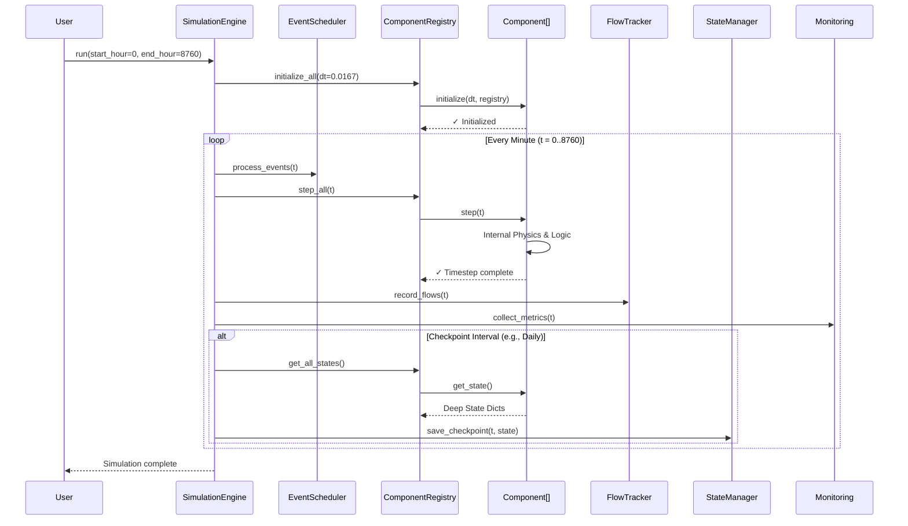

# Dual-Path Hydrogen Production System v2.0 - System Architecture

**Document Version:** 1.2
**Last Updated:** December 13, 2025
**Target Audience:** Senior Engineers, System Architects, New Maintainers

---

## Purpose

This document provides a **comprehensive architectural overview** of the Dual-Path Hydrogen Production System v2.0. It details the execution flow, layered design, and critical advanced capabilities that elevate the system from a simple simulator to a high-fidelity engineering tool.

---

## System Overview

The Dual-Path Hydrogen Production System is a **modular, high-performance simulation framework** for modeling industrial-scale hydrogen production. It combines rigorous thermodynamic physics with event-driven orchestration to model:

-   **Dual Pathways:** Grid-powered electrolysis and natural gas autothermal reforming (ATR).
-   **Complex Physics:** Real-gas mixtures (H₂, O₂, CO₂, H₂O) with phase equilibrium.
-   **Deep Composition:** Recursive subsystems (e.g., electrolyzers containing pumps, heat exchangers).
-   **HPC Performance:** Sub-millisecond timesteps via LUT caching and Numba JIT.
-   **Interactive GUI:** Node-based visual editor for plant configuration.
-   **Rich Visualization:** Automated generation of interactive dashboards and reports.

**Scale:** 8,760 hours (525,600 minutes) per annual simulation cycle.

---

## Execution Flow: SimulationEngine Loop

The core execution pattern follows a **registry-driven event loop** where the `SimulationEngine` orchestrates component lifecycle management through the `ComponentRegistry`.

### Sequence Diagram



---

## Layered Architecture (6 Layers)

The system is organized into **six distinct layers**, plus a set of **Advanced Capabilities** that cut across layers.

### Layer 1: Core Foundation
**Purpose:** Establish standardized interfaces and shared abstractions.
-   **`Component` ABC:** Defines the strict `initialize`, `step`, `get_state` lifecycle contract.
-   **`ComponentRegistry`:** Central orchestrator for dependency injection and component management.
-   **`Integer Enums`:** Numba-compatible state definitions (`TankState`, `FlowType`).

### Layer 2: Performance Optimization
**Purpose:** Achieve 50-200x speedup on computational bottlenecks.
-   **`LUTManager`:** 3D lookup tables for pure fluids and **mixture properties** (H₂/O₂/CO₂/H₂O).
-   **`numba_ops`:** JIT-compiled hot paths for flash calculations, tank array operations, and solvers.
-   **`TankArray`:** Vectorized storage logic using NumPy.

### Layer 3: Component Implementations
**Purpose:** Standardized simulation entities.
-   **Production & Reforming:** `DetailedPEMElectrolyzer` (`h2_plant/components/electrolysis/pem_electrolyzer.py`), `SOECOperator` (`h2_plant/components/electrolysis/soec_operator.py`), `ATRReactor` (`h2_plant/components/reforming/atr_reactor.py`), `WGSReactor` (`h2_plant/components/reforming/wgs_reactor.py`).
-   **Storage:** `H2StorageTankEnhanced` (`h2_plant/components/storage/h2_storage_enhanced.py`), `SourceIsolatedTanks` (`h2_plant/components/storage/source_isolated_tanks.py`), `OxygenBuffer` (`h2_plant/components/storage/oxygen_buffer.py`), `BatteryStorage` (`h2_plant/components/storage/battery_storage.py`), `TankArray` (`h2_plant/components/storage/h2_tank.py`).
-   **Compression & Logistics:** `CompressorStorage` (`h2_plant/components/compression/compressor.py`), `ThrottlingValve` (`h2_plant/components/control/valve.py`), `Consumer` (`h2_plant/components/logistics/consumer.py`), `H2Distribution` (`h2_plant/components/mixing/h2_distribution.py`).
-   **Separation & Purification:** `KnockOutDrum` (`h2_plant/components/separation/knock_out_drum.py`), `Coalescer` (`h2_plant/components/separation/coalescer.py`), `PSA` (`h2_plant/components/separation/psa.py`), `TSAUnit` (`h2_plant/components/separation/tsa_unit.py`), `SeparationTank` (`h2_plant/components/separation/separation_tank.py`), `DeoxoReactor` (`h2_plant/components/purification/deoxo_reactor.py`).
-   **Carbon Management:** `DetailedCO2Capture` (`h2_plant/components/carbon/co2_capture_detailed.py`), `CO2Storage` (`h2_plant/components/carbon/co2_storage.py`).
-   **Thermal Management:** `Chiller` (`h2_plant/components/thermal/chiller.py`), `DryCooler` (`h2_plant/components/cooling/dry_cooler.py`), `HeatExchanger` (`h2_plant/components/thermal/heat_exchanger.py`), `SteamGenerator` (`h2_plant/components/thermal/steam_generator.py`), `ThermalManager` (`h2_plant/components/thermal/thermal_manager.py`).
-   **Water Systems:** `DetailedWaterTreatment` (`h2_plant/components/water/water_treatment_detailed.py`), `WaterQualityTestBlock` (`h2_plant/components/water/quality_test.py`), `WaterBalanceTracker` (`h2_plant/components/water/water_balance_tracker.py`), `WaterPumpThermodynamic` (`h2_plant/components/water/water_pump.py`), `UltrapureWaterStorageTank` (`h2_plant/components/water/storage.py`), `UltraPureWaterTank` (`h2_plant/components/water/ultrapure_water_tank.py`).
-   **Mixing:** `OxygenMixer` (`h2_plant/components/mixing/oxygen_mixer.py`), `MultiComponentMixer` (`h2_plant/components/mixing/multicomponent_mixer.py`), `WaterMixer` (`h2_plant/components/mixing/water_mixer.py`).
-   **Power:** `Rectifier` (`h2_plant/components/power/rectifier.py`).
-   **Environment & External:** `EnvironmentManager` (`h2_plant/components/environment/environment_manager.py`), `BiogasSource` (`h2_plant/components/external/biogas_source.py`), `ExternalOxygenSource` (`h2_plant/components/external/oxygen_source.py`), `ExternalHeatSource` (`h2_plant/components/external/heat_source.py`).
-   **Utility & Coordination:** `DemandScheduler` (`h2_plant/components/utility/demand_scheduler.py`), `EnergyPriceTracker` (`h2_plant/components/utility/energy_price_tracker.py`), `SimpleWindCoordinator` (`h2_plant/components/coordination/simple_wind_coordinator.py`).

### Layer 4: Pathway Orchestration
**Purpose:** Coordinate production and allocation strategies.
-   **`DualPathCoordinator`:** Economic optimization and demand allocation logic.
-   **`IsolatedProductionPath`:** Encapsulates source → storage → compression chains.
-   **`IntegratedPlant`:** Full plant coordinator wiring all subsystems together.
-   **`AllocationStrategies`:** Algorithmic strategies (Cost, Emissions, Balanced) for demand splitting.

### Layer 5: Simulation Engine
**Purpose:** Execution and monitoring.
-   **`SimulationEngine`:** Main loop and event scheduling.
-   **`Integrated Dispatch`:** Replaces legacy orchestration with a high-performance control loop[file:8][file:9].
    -   **`dispatch.py`:** Pure logic for power allocation (Grid vs Electrolyzer vs Sales).
    -   **`engine_dispatch.py`:** Binds logic to the engine with **pre-allocated NumPy arrays** for history.
    -   **Pattern:** Separation of *Intention* (Dispatch sets inputs) vs *Outcome* (Physics determines outputs).
-   **`EventScheduler`:** Time-based and recurring event management (maintenance, price updates).
-   **`StateManager`:** Checkpoint persistence (JSON/Pickle).
-   **`MonitoringSystem`:** Real-time metrics.
-   **`FlowTracker`:** Topology-aware flow tracking for Sankey diagrams.
-   **`MetricsCollector`:** Centralized data gathering for the visualization system.

### Layer 6: User Interface
**Purpose:** Visual configuration and interaction.
-   **`PlantEditorWindow`:** Main GUI entry point (PySide6).
-   **`NodeEditor`:** Visual programming interface for connecting components.
-   **`GraphGenerator`:** Post-simulation reporting engine.

---

## Integrated Control Architecture

The system employs a **Split-Layer Control Architecture** to manage plant dispatch and power arbitration. This design separates economic decision-making from physical execution, enabling high-frequency optimization without coupling physics to control logic.

### 1. Architecture Overview
The control system replaces the legacy `Orchestrator` with a two-part implementation:

*   **Logic Layer (`control/dispatch.py`)**: Pure Python classes (e.g., `ReferenceHybridStrategy`) that determine *intent*. They process market signals (price, wind availability) and output power setpoints (MW to SOEC, MW to PEM, MW to Grid). This layer is stateless regarding physics but stateful regarding control decisions (e.g., hysteresis, arbitrage mode).
*   **Binding Layer (`control/engine_dispatch.py`)**: The `HybridArbitrageEngineStrategy` binds the logic to the `SimulationEngine`. It handles:
    *   **Pre-allocation**: Creates NumPy arrays for the entire simulation duration (8760 hours) at initialization, providing 10-50x speedup over dynamic lists.
    *   **Application**: Injects setpoints into standard components via `receive_input()` before the physics step.
    *   **Recording**: collecting *actual* outcomes (real power consumed, H2 produced) after the physics step.

### 2. Execution Cycle
The `SimulationEngine` executes the control loop in three precise phases per timestep:

1.  **Decide & Apply (Pre-Step)**:
    -   Engine calls `dispatch.decide_and_apply(t, prices, wind)`.
    -   Strategy calculates optimal split based on arbitrage threshold ($P_{threshold} = P_{PPA} + (1000/\eta) \times P_{H2}$).
    -   Strategy sets `power_kw` inputs on Electrolyzer components.
2.  **Physics Execution (Step)**:
    -   Engine calls `registry.step_all(t)`.
    -   Components consume power, produce hydrogen, and update thermal states.
    -   *Note*: Components may consume less than the setpoint if constrained by temperature or maintenance.
3.  **Record (Post-Step)**:
    -   Engine calls `dispatch.record_post_step()`.
    -   Strategy reads actual state (e.g., `pem.P_consumed_W`) and writes to history arrays.

---

## Component Lifecycle Contract

Every component, whether atomic or composite, follows the strict three-phase lifecycle:

1.  **`initialize(dt, registry)`**:
    -   Allocate memory and pre-compute constants.
    -   Resolve dependencies (lookup other components in registry).
    -   Initialize child components (if composite).
2.  **`step(t)`**:
    -   Execute physics, mixing logic, and reactions.
    -   Update internal state based on inputs and time `dt`.
    -   Ensure causal execution (inputs → processing → outputs).
3.  **`get_state()`**:
    -   Return a JSON-serializable dictionary representing the full internal state.
    -   For composites, this recursively includes nested states of all sub-components.

---

## Directory Structure

Understanding the project layout helps you navigate quickly to the right location.

```
h2_plant/
├── components/           # Layer 3: All simulation entities
│   ├── electrolysis/     #   PEM, SOEC electrolyzers
│   ├── storage/          #   Tank arrays, oxygen buffers
│   ├── compression/      #   Multi-stage compressors
│   ├── separation/       #   PSA, TSA, Coalescer, Knock-out drums
│   ├── thermal/          #   Chillers, heat exchangers
│   ├── water/            #   Water treatment, pumps, tanks
│   ├── mixing/           #   Gas mixers
│   ├── carbon/           #   CO2 capture and storage
│   ├── external/         #   External sources (biogas, heat)
│   └── utility/          #   Price tracker, demand scheduler
│
├── control/              # Layer 5: Dispatch logic
│   ├── dispatch.py       #   Pure control strategies (Intent)
│   └── engine_dispatch.py#   Engine binding with NumPy arrays (Outcome)
│
├── core/                 # Layer 1: Foundation
│   ├── component.py      #   Component ABC
│   ├── component_registry.py  #   Central registry
│   ├── stream.py         #   Stream dataclass for flow
│   ├── constants.py      #   Physical constants
│   └── enums.py          #   State enumerations
│
├── simulation/           # Layer 5: Engine and infrastructure
│   ├── engine.py         #   SimulationEngine main loop
│   ├── event_scheduler.py#   Time-based events
│   ├── state_manager.py  #   Checkpoint persistence
│   ├── flow_network.py   #   Topology-aware flow routing
│   └── monitoring.py     #   Real-time metrics collection
│
├── optimization/         # Layer 2: Performance
│   ├── lut_manager.py    #   Lookup tables for thermodynamics
│   ├── numba_ops.py      #   JIT-compiled hot paths
│   └── coolprop_lut.py   #   CoolProp wrapper with caching
│
├── pathways/             # Layer 4: Orchestration strategies
│   ├── integrated_plant.py    #   Full plant coordinator
│   ├── isolated_production_path.py  #   Source→Storage→Compression
│   └── allocation_strategies.py     #   Demand splitting logic
│
├── config/               # Configuration files
│   ├── plant_config.py   #   Pydantic models for validation
│   ├── constants_physics.py  #   Physical constants (SI units)
│   └── simulation_config.yaml  #   Default simulation settings
│
├── gui/                  # Layer 6: User interface (PySide6)
│   ├── main_window.py    #   Application entry point
│   ├── node_editor/      #   Visual component wiring
│   └── core/             #   Backend-GUI bridge
│
├── visualization/        # Post-simulation reporting
│   └── dashboard_generator.py  #   Interactive HTML reports
│
└── data/                 # Input data files
    ├── prices/           #   Electricity price timeseries
    ├── wind/             #   Wind availability profiles
    └── demand/           #   Demand schedules
```

---

## Quick Navigation: Common Tasks

### "I need to add a new component"
1.  Create file in `h2_plant/components/<category>/my_component.py`
2.  Inherit from `Component` (`from h2_plant.core.component import Component`)
3.  Implement `initialize()`, `step()`, `get_state()` (see `developer_guide_component.md`)
4.  Register in `h2_plant/core/graph_builder.py` for GUI support

### "I need to change the control logic"
1.  **Intent changes** → Edit `h2_plant/control/dispatch.py`
    -   Modify `ReferenceHybridStrategy.decide()` for arbitrage logic
    -   Add new strategy by subclassing `DispatchStrategy`
2.  **Recording changes** → Edit `h2_plant/control/engine_dispatch.py`
    -   Add fields to `_history` dict in `initialize()`
    -   Update `record_post_step()` to capture new metrics

### "I need to modify the simulation loop"
1.  Main loop is in `h2_plant/simulation/engine.py:SimulationEngine._execute_timestep()`
2.  Execution order is defined in the `execution_order` list (line ~273)
3.  Add pre/post hooks via `pre_step_callback` / `post_step_callback`

### "I need to change thermodynamic properties"
1.  Pure fluid lookups → `h2_plant/optimization/lut_manager.py`
2.  Physical constants → `h2_plant/config/constants_physics.py`
3.  Add new species → Update `GasConstants` in `h2_plant/core/constants.py`

### "I need to add a new GUI element"
1.  Component palette → `h2_plant/gui/widgets/palette_panel.py`
2.  Properties panel → `h2_plant/gui/core/property_inspector.py`
3.  Backend binding → `h2_plant/gui/core/graph_adapter.py`

---

## Data Flow Patterns

### Stream Propagation (Push Architecture)
Components push data downstream via `receive_input()`:
```
Producer.step() → Downstream.receive_input(port, stream, resource_type)
```

### Control Flow (Pull Architecture)
Dispatch queries component state after physics:
```
Engine → dispatch.record_post_step() → component.get_state()['actual_power']
```

### Registry Pattern
Components resolve dependencies at initialization:
```python
def initialize(self, dt, registry):
    self._lut = registry.get(ComponentID.LUT_MANAGER)
```

---

## Configuration Guide

### Simulation Parameters
Located in `h2_plant/config/plant_config.py`:
-   `timestep_hours`: Default 1/60 (1 minute)
-   `duration_hours`: Total simulation length
-   `checkpoint_interval_hours`: State save frequency

### Physical Constants
Located in `h2_plant/config/constants_physics.py`:
-   **SI Units** for internal calculations
-   **Engineering Units** for GUI display (converted at boundaries)

### Unit Conventions
| Domain     | Internal (SI)      | Display (Engineering) |
|------------|--------------------|-----------------------|
| Pressure   | Pa                 | bar                   |
| Temperature| K                  | °C                    |
| Mass Flow  | kg/s               | kg/h                  |
| Power      | W                  | MW                    |

---

## Related Documentation

| Document | Purpose |
|----------|---------|
| [developer_guide_component.md](developer_guide_component.md) | How to implement new components |
| [BACKEND_DIAGRAM.md](BACKEND_DIAGRAM.md) | Detailed execution flow diagrams |
| [docs/diagrams/](diagrams/) | Component-level architecture diagrams |
| [README.md](../README.md) | Project overview and quick start |

---
