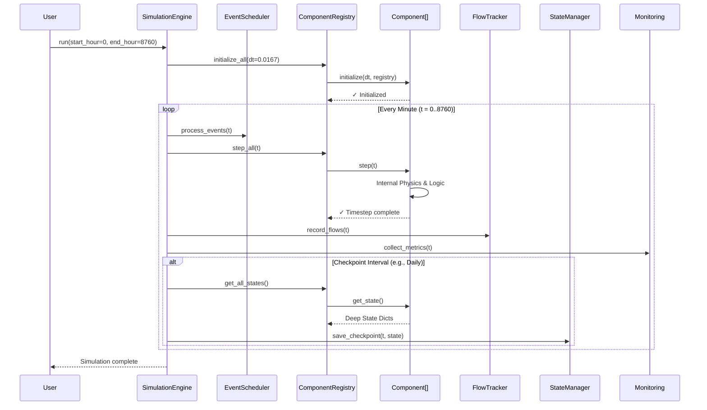

# Dual-Path Hydrogen Production System v2.0 - System Architecture

**Document Version:** 1.2
**Last Updated:** December 13, 2025
**Target Audience:** Senior Engineers, System Architects, New Maintainers

---

## Purpose

This document provides a **comprehensive architectural overview** of the Dual-Path Hydrogen Production System v2.0. It details the execution flow, layered design, and critical advanced capabilities that elevate the system from a simple simulator to a high-fidelity engineering tool.

---

## System Overview

The Dual-Path Hydrogen Production System is a **modular, high-performance simulation framework** for modeling industrial-scale hydrogen production. It combines rigorous thermodynamic physics with event-driven orchestration to model:

-   **Dual Pathways:** Grid-powered electrolysis and natural gas autothermal reforming (ATR).
-   **Complex Physics:** Real-gas mixtures (H₂, O₂, CO₂, H₂O) with phase equilibrium.
-   **Deep Composition:** Recursive subsystems (e.g., electrolyzers containing pumps, heat exchangers).
-   **HPC Performance:** Sub-millisecond timesteps via LUT caching and Numba JIT.
-   **Interactive GUI:** Node-based visual editor for plant configuration.
-   **Rich Visualization:** Automated generation of interactive dashboards and reports.

**Scale:** 8,760 hours (525,600 minutes) per annual simulation cycle.

---

## Execution Flow: SimulationEngine Loop

The core execution pattern follows a **registry-driven event loop** where the `SimulationEngine` orchestrates component lifecycle management through the `ComponentRegistry`.

### Sequence Diagram

---

## Layered Architecture (6 Layers)

The system is organized into **six distinct layers**, plus a set of **Advanced Capabilities** that cut across layers.

### Layer 1: Core Foundation
**Purpose:** Establish standardized interfaces and shared abstractions.
-   **`Component` ABC:** Defines the strict `initialize`, `step`, `get_state` lifecycle contract.
-   **`ComponentRegistry`:** Central orchestrator for dependency injection and component management.
-   **`Integer Enums`:** Numba-compatible state definitions (`TankState`, `FlowType`).

### Layer 2: Performance Optimization
**Purpose:** Achieve 50-200x speedup on computational bottlenecks.
-   **`LUTManager`:** 3D lookup tables for pure fluids and **mixture properties** (H₂/O₂/CO₂/H₂O).
-   **`numba_ops`:** JIT-compiled hot paths for flash calculations, tank array operations, and solvers.
-   **`TankArray`:** Vectorized storage logic using NumPy.

### Layer 3: Component Implementations
**Purpose:** Standardized simulation entities.
-   **Production:** `DetailedPEMElectrolyzer`, `SOECOperator`, `ATRProductionSource`.
-   **Storage:** `TankArray`, `SourceIsolatedTanks`, `OxygenBuffer`.
-   **Compression:** `FillingCompressor`, `OutgoingCompressor`.
-   **Separation:** `KnockOutDrum`, `Coalescer`, `OxygenMixer`, `MultiComponentMixer`.
-   **Thermal:** `Chiller`, `HeatExchanger`.
-   **Water:** `DetailedWaterTreatment`, `WaterQualityTestBlock`.
-   **Utility:** `DemandScheduler`, `EnergyPriceTracker`.

### Layer 4: Pathway Orchestration
**Purpose:** Coordinate production and allocation strategies.
-   **`DualPathCoordinator`:** Economic optimization and demand allocation logic.
-   **`IsolatedProductionPath`:** Encapsulates source → storage → compression chains.
-   **`IntegratedPlant`:** Full plant coordinator wiring all subsystems together.
-   **`AllocationStrategies`:** Algorithmic strategies (Cost, Emissions, Balanced) for demand splitting.

### Layer 5: Simulation Engine
**Purpose:** Execution and monitoring.
-   **`SimulationEngine`:** Main loop and event scheduling.
-   **`Integrated Dispatch`:** Replaces legacy orchestration with a high-performance control loop[file:8][file:9].
    -   **`dispatch.py`:** Pure logic for power allocation (Grid vs Electrolyzer vs Sales).
    -   **`engine_dispatch.py`:** Binds logic to the engine with **pre-allocated NumPy arrays** for history.
    -   **Pattern:** Separation of *Intention* (Dispatch sets inputs) vs *Outcome* (Physics determines outputs).
-   **`EventScheduler`:** Time-based and recurring event management (maintenance, price updates).
-   **`StateManager`:** Checkpoint persistence (JSON/Pickle).
-   **`MonitoringSystem`:** Real-time metrics.
-   **`FlowTracker`:** Topology-aware flow tracking for Sankey diagrams.
-   **`MetricsCollector`:** Centralized data gathering for the visualization system.

### Layer 6: User Interface
**Purpose:** Visual configuration and interaction.
-   **`PlantEditorWindow`:** Main GUI entry point (PySide6).
-   **`NodeEditor`:** Visual programming interface for connecting components.
-   **`GraphGenerator`:** Post-simulation reporting engine.

---

## Integrated Control Architecture

The system employs a **Split-Layer Control Architecture** to manage plant dispatch and power arbitration. This design separates economic decision-making from physical execution, enabling high-frequency optimization without coupling physics to control logic.

### 1. Architecture Overview
The control system replaces the legacy `Orchestrator` with a two-part implementation:

*   **Logic Layer (`control/dispatch.py`)**: Pure Python classes (e.g., `ReferenceHybridStrategy`) that determine *intent*. They process market signals (price, wind availability) and output power setpoints (MW to SOEC, MW to PEM, MW to Grid). This layer is stateless regarding physics but stateful regarding control decisions (e.g., hysteresis, arbitrage mode).
*   **Binding Layer (`control/engine_dispatch.py`)**: The `HybridArbitrageEngineStrategy` binds the logic to the `SimulationEngine`. It handles:
    *   **Pre-allocation**: Creates NumPy arrays for the entire simulation duration (8760 hours) at initialization, providing 10-50x speedup over dynamic lists.
    *   **Application**: Injects setpoints into standard components via `receive_input()` before the physics step.
    *   **Recording**: collecting *actual* outcomes (real power consumed, H2 produced) after the physics step.

### 2. Execution Cycle
The `SimulationEngine` executes the control loop in three precise phases per timestep:

1.  **Decide & Apply (Pre-Step)**:
    -   Engine calls `dispatch.decide_and_apply(t, prices, wind)`.
    -   Strategy calculates optimal split based on arbitrage threshold ($P_{threshold} = P_{PPA} + (1000/\eta) \times P_{H2}$).
    -   Strategy sets `power_kw` inputs on Electrolyzer components.
2.  **Physics Execution (Step)**:
    -   Engine calls `registry.step_all(t)`.
    -   Components consume power, produce hydrogen, and update thermal states.
    -   *Note*: Components may consume less than the setpoint if constrained by temperature or maintenance.
3.  **Record (Post-Step)**:
    -   Engine calls `dispatch.record_post_step()`.
    -   Strategy reads actual state (e.g., `pem.P_consumed_W`) and writes to history arrays.

---

## Component Lifecycle Contract

Every component, whether atomic or composite, follows the strict three-phase lifecycle:

1.  **`initialize(dt, registry)`**:
    -   Allocate memory and pre-compute constants.
    -   Resolve dependencies (lookup other components in registry).
    -   Initialize child components (if composite).
2.  **`step(t)`**:
    -   Execute physics, mixing logic, and reactions.
    -   Update internal state based on inputs and time `dt`.
    -   Ensure causal execution (inputs → processing → outputs).
3.  **`get_state()`**:
    -   Return a JSON-serializable dictionary representing the full internal state.
    -   For composites, this recursively includes nested states of all sub-components.

---
