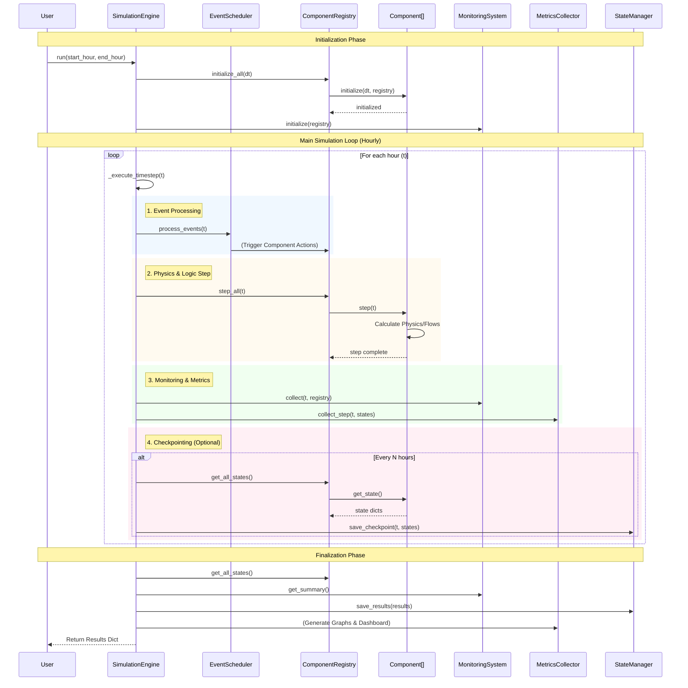

# Backend Architecture Diagram

This document provides a visual representation of the backend execution flow for the Dual-Path Hydrogen Production System.

## Simulation Execution Flow

## Key Components

1.  **SimulationEngine**: The central conductor. It manages the clock, triggers events, steps components, and handles data persistence.
2.  **ComponentRegistry**: A central directory of all system components (Electrolyzers, Tanks, etc.). It abstracts the complexity of iterating over hundreds of components.
3.  **EventScheduler**: Handles dynamic events (e.g., "Grid Power Outage at hour 500"). It injects changes into components at specific times.
4.  **Components**: The actual physical models. They implement the `step(t)` method to calculate their internal physics (mass balance, energy balance) for one timestep.
5.  **MonitoringSystem**: Observes the system. It collects time-series data (e.g., "H2 Production Rate", "Tank Level") for analysis and dashboard generation.
6.  **MetricsCollector**: Specialized data collector for the Visualization system. It feeds data into the GraphGenerator.
7.  **StateManager**: Handles saving/loading simulation state to disk, allowing for checkpoints and resuming long simulations.
