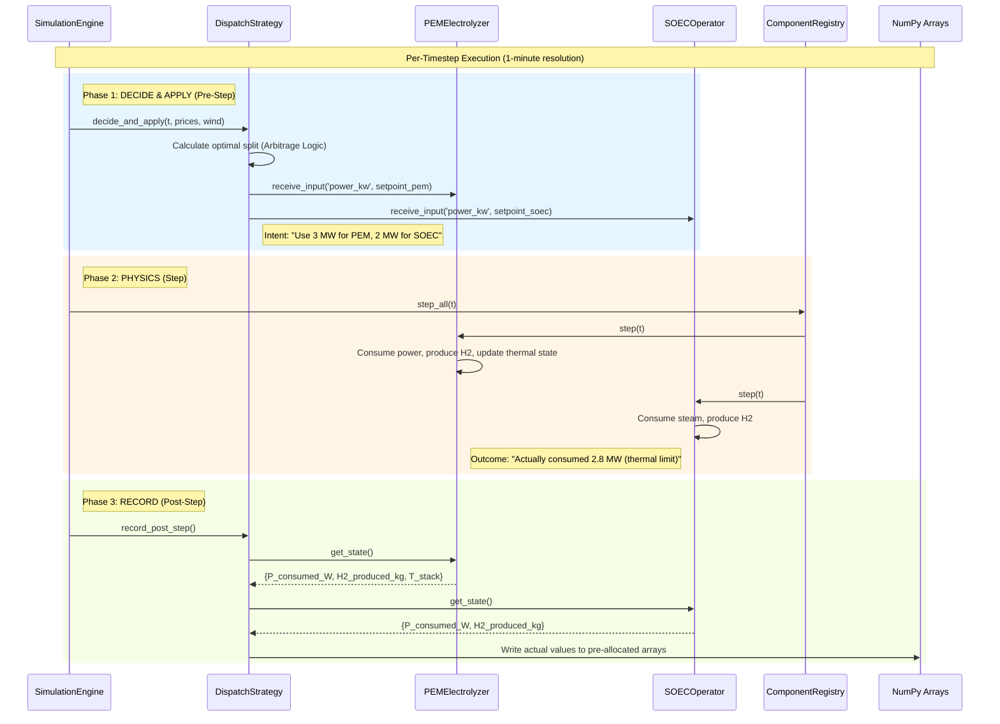
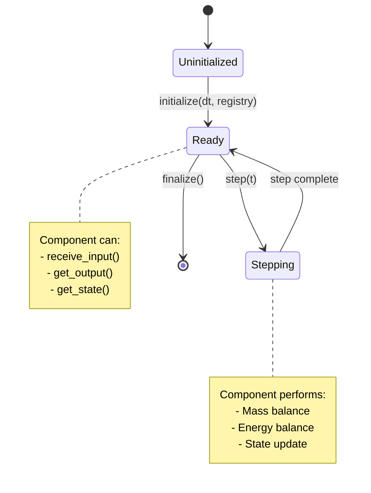
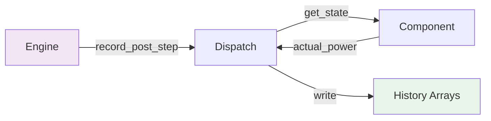

# Backend Architecture Diagram

This document provides a visual representation of the backend execution flow for the Hydrogen Production System, including the Integrated Control Architecture.

---

## Simulation Execution Flow (Legacy View)


---

## Integrated Control Architecture (New)

The Integrated Control Architecture separates **Intent** (what we want to happen) from **Outcome** (what physics allows). This enables high-frequency optimization without coupling control logic to physics calculations.

### Execution Cycle Diagram



### Key Concepts

| Concept | Description |
|---------|-------------|
| **Intent** | Power setpoints calculated by `dispatch.py` based on prices and availability. |
| **Outcome** | Actual consumption/production after physics constraints (temperature limits, ramp rates). |
| **Pre-allocation** | `HybridArbitrageEngineStrategy` creates NumPy arrays for entire simulation duration at initialization. |
| **Arbitrage Threshold** | `P_threshold = P_PPA + (1000/η) × P_H2`. Below threshold, produce H₂; above, sell to grid. |

---

## Component Lifecycle Flow

Every component follows this three-phase lifecycle:



---

## Data Flow Patterns

### Stream Propagation (Push Architecture)

```mermaid
flowchart LR
    A[Producer] -->|step()| B[output_stream]
    B -->|receive_input| C[Consumer.inlet]
    C -->|step()| D[Consumer Output]
    
    style A fill:#e1f5fe
    style C fill:#fff3e0
```

### Control Flow (Pull Architecture)



---

## Key Components

| Component | Role | File |
|-----------|------|------|
| **SimulationEngine** | Main loop, timestep management | `simulation/engine.py` |
| **ComponentRegistry** | Central component directory | `core/component_registry.py` |
| **DispatchStrategy** | Power allocation logic (Intent) | `control/dispatch.py` |
| **HybridArbitrageEngineStrategy** | Engine binding (Outcome recording) | Imported in `run_integrated_simulation.py` |
| **EventScheduler** | Time-based event injection | `simulation/event_scheduler.py` |
| **MonitoringSystem** | Real-time metrics collection | `simulation/monitoring.py` |
| **FlowNetwork** | Topology-aware flow routing | `simulation/flow_network.py` |
| **StateManager** | Checkpoint persistence | `simulation/state_manager.py` |

---

## Performance Optimizations

The Integrated Control Architecture achieves 10-50x speedup through:

1. **Pre-allocated NumPy Arrays**: History arrays created once at initialization for entire simulation duration.
2. **Vectorized Operations**: Batch calculations where possible (e.g., efficiency curves).
3. **LUT Manager**: Thermodynamic lookups via bilinear interpolation instead of CoolProp calls.
4. **Numba JIT**: Hot paths (PFR solver, flash equilibrium) compiled to machine code.

```python
# Example: Pre-allocation in HybridArbitrageEngineStrategy
def initialize(self, registry, context, total_steps):
    # Pre-allocate arrays for entire simulation duration
    self._history = {
        'minute': np.zeros(total_steps, dtype=np.int32),
        'P_soec_actual': np.zeros(total_steps, dtype=np.float32),
        'H2_soec_kg': np.zeros(total_steps, dtype=np.float32),
        'spot_price': np.zeros(total_steps, dtype=np.float32),
    }
```

