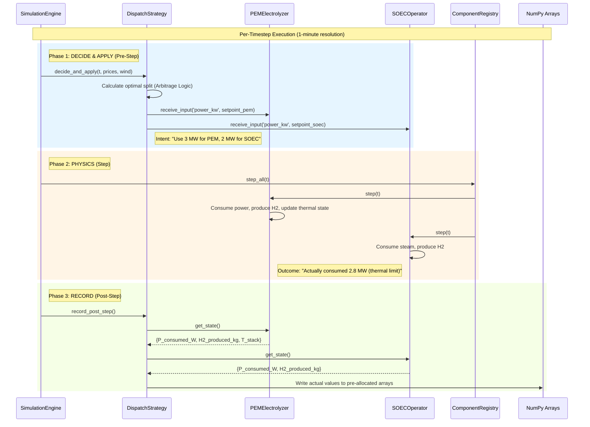
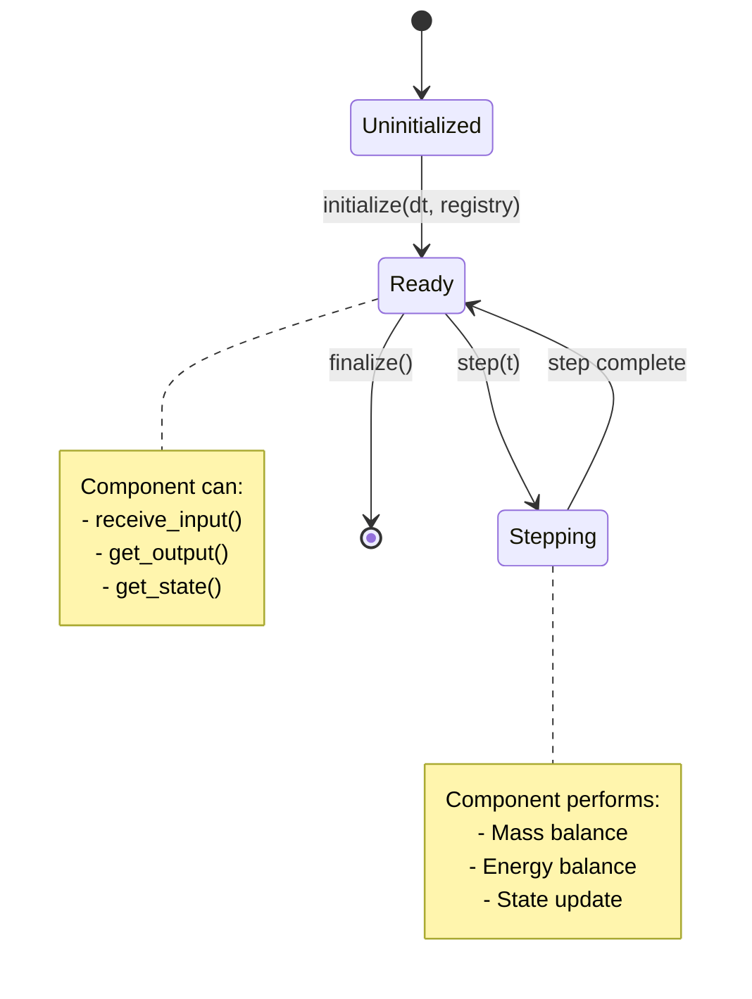
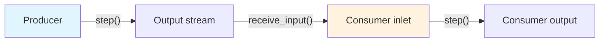
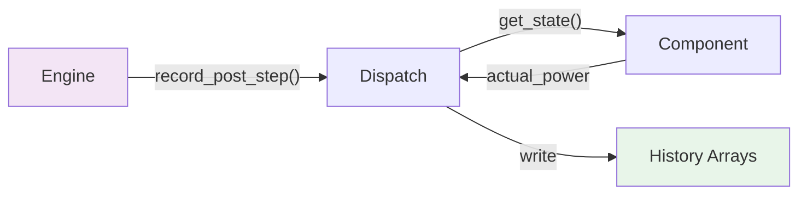
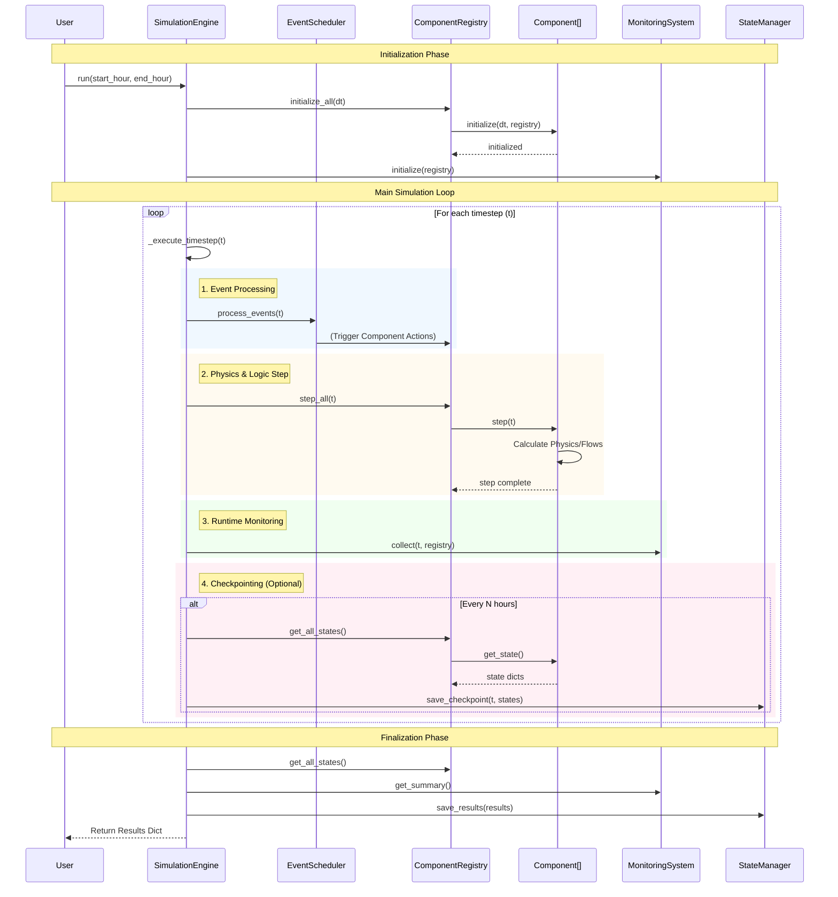

# Backend Execution Flow - Diagrams & Module Reference

**Status:** Current diagrams updated March 2026; legacy section retained for architecture history only.
**Last Reviewed:** March 2026
**Scope:** Execution-flow sequence diagrams for the active dispatch architecture, plus historical reference and control-layer module map. For the full system-level package overview see [ARCHITECTURE.md](ARCHITECTURE.md).

---

## Current Backend Flow - Integrated Dispatch

The active backend uses a **Split-Layer Control Architecture** that decouples *Intent* (dispatch decisions) from *Outcome* (physics results). This is the governing model for all current and new development.

### Execution Cycle (Per Timestep)


```mermaid
sequenceDiagram
    participant Engine as SimulationEngine
    participant Dispatch as DispatchStrategy
    participant PEM as PEMElectrolyzer
    participant SOEC as SOECOperator
    participant Registry as ComponentRegistry
    participant History as NumPy Arrays

    Note over Engine, History: Per-Timestep Execution (1-minute resolution)

    rect rgb(230, 245, 255)
        Note right of Engine: Phase 1: DECIDE & APPLY (Pre-Step)
        Engine->>Dispatch: decide_and_apply(t, prices, wind)
        Dispatch->>Dispatch: Calculate optimal split (Arbitrage Logic)
        Dispatch->>PEM: receive_input('power_kw', setpoint_pem)
        Dispatch->>SOEC: receive_input('power_kw', setpoint_soec)
        Note right of Dispatch: Intent: "Use 3 MW for PEM, 2 MW for SOEC"
    end

    rect rgb(255, 245, 230)
        Note right of Engine: Phase 2: PHYSICS (Step)
        Engine->>Registry: step_all(t)
        Registry->>PEM: step(t)
        PEM->>PEM: Consume power, produce H2, update thermal state
        Registry->>SOEC: step(t)
        SOEC->>SOEC: Consume steam, produce H2
        Note right of PEM: Outcome: "Actually consumed 2.8 MW (thermal limit)"
    end

    rect rgb(245, 255, 230)
        Note right of Engine: Phase 3: RECORD (Post-Step)
        Engine->>Dispatch: record_post_step()
        Dispatch->>PEM: get_state()
        PEM-->>Dispatch: {P_consumed_W, H2_produced_kg, T_stack}
        Dispatch->>SOEC: get_state()
        SOEC-->>Dispatch: {P_consumed_W, H2_produced_kg}
        Dispatch->>History: Write actual values to pre-allocated arrays
    end
```

### Key Concepts

| Concept | Description |
|---------|-------------|
| **Intent** | Power setpoints calculated by `dispatch.py` based on market prices and wind availability. |
| **Outcome** | Actual consumption/production after physics constraints (temperature limits, ramp rates, maintenance states). |
| **Pre-allocation** | `HybridArbitrageEngineStrategy` (in `h2_plant/control/engine_dispatch.py`) creates NumPy history arrays for the entire simulation duration at initialization, giving 10-50x speedup over dynamic lists. |
| **Arbitrage Threshold** | `P_threshold = P_PPA + (1000/eta) x Price_H2`. Below threshold: produce H2; above: sell to grid. |

---

## Module Map - Control & Engine Layer

Authoritative ownership table for the dispatch and engine modules as of March 2026.

| Module | Responsibility |
|--------|----------------|
| `h2_plant/simulation/engine.py` | Timestep loop, event scheduling, component orchestration |
| `h2_plant/control/dispatch.py` | Pure dispatch decision logic - intent layer; stateless with respect to physics; defines `DispatchStrategy` ABC, `ReferenceHybridStrategy`, `SoecOnlyStrategy` |
| `h2_plant/control/engine_dispatch.py` | Engine-coupled dispatch integration; hosts `HybridArbitrageEngineStrategy` including pre-allocation and post-step recording; **primary home of active dispatch implementation** |
| `h2_plant/run_integrated_simulation.py` | CLI entry point - wires strategies from `engine_dispatch.py` into the engine and invokes the simulation |
| `h2_plant/simulation/event_scheduler.py` | Time-based and recurring event management (maintenance, price updates) |
| `h2_plant/simulation/flow_network.py` | Topology-aware flow routing between components |
| `h2_plant/simulation/flow_tracker.py` | Stream tracking for Sankey diagrams |
| `h2_plant/simulation/state_manager.py` | Checkpoint persistence (JSON/Pickle) |
| `h2_plant/simulation/monitoring.py` | Runtime metrics collection - in-loop, part of core engine execution |
| `h2_plant/visualization/graph_orchestrator.py` | Post-run metrics aggregation and graph generation — **downstream reporting step, replacing the deprecated MetricsCollector** |

---

## Component Lifecycle

Every component follows a strict three-phase lifecycle:


```mermaid
stateDiagram-v2
    [*] --> Uninitialized
    Uninitialized --> Ready: initialize(dt, registry)
    Ready --> Stepping: step(t)
    Stepping --> Ready: step complete
    Ready --> [*]: finalize()
    
    note right of Ready
        Component can:
        - receive_input()
        - get_output()
        - get_state()
    end note
    
    note right of Stepping
        Component performs:
        - Mass balance
        - Energy balance
        - State update
    end note
```

---

## Data Flow Patterns

### Stream Propagation (Push Architecture)


```mermaid
flowchart LR
    A["Producer"] -->|"step()"| B["Output stream"]
    B -->|"receive_input()"| C["Consumer inlet"]
    C -->|"step()"| D["Consumer output"]

    style A fill:#e1f5fe
    style C fill:#fff3e0
```

### Control Flow (Pull Architecture)


```mermaid
flowchart LR
    E["Engine"] -->|"record_post_step()"| F["Dispatch"]
    F -->|"get_state()"| G["Component"]
    G -->|"actual_power"| F
    F -->|"write"| H["History Arrays"]

    style E fill:#f3e5f5
    style H fill:#e8f5e9
```

---

## Performance Optimizations

The integrated dispatch architecture achieves 10-50x speedup over the legacy model through:

1. **Pre-allocated NumPy Arrays** - history arrays created once for the entire simulation duration in `HybridArbitrageEngineStrategy` (`h2_plant/control/engine_dispatch.py`).
2. **Vectorized Operations** - batch calculations where possible (e.g., efficiency curves).
3. **LUT Manager** - thermodynamic lookups via bilinear interpolation instead of live CoolProp calls.
4. **Numba JIT** - hot paths (PFR solver, flash equilibrium) compiled to machine code.

```python
# Pre-allocation in HybridArbitrageEngineStrategy
# Location: h2_plant/control/engine_dispatch.py
def initialize(self, registry, context, total_steps):
    self._history = {
        'minute':        np.zeros(total_steps, dtype=np.int32),
        'P_soec_actual': np.zeros(total_steps, dtype=np.float32),
        'H2_soec_kg':    np.zeros(total_steps, dtype=np.float32),
        'spot_price':    np.zeros(total_steps, dtype=np.float32),
    }
```

---

## Historical Execution Flow (Deprecated)

> **Deprecated.** This diagram depicts the legacy `Orchestrator`-based execution model that preceded the current integrated dispatch architecture described above. It is retained here for architecture history only.
>
> **No active code paths in the current codebase follow this flow.** New development should reference the *Current Backend Flow* section above. If you are debugging a code path that leads through `h2_plant/orchestrator.py`, note that file is explicitly marked deprecated and should not be extended.


```mermaid
sequenceDiagram
    participant User
    participant Engine as SimulationEngine
    participant Scheduler as EventScheduler
    participant Registry as ComponentRegistry
    participant Components as Component[]
    participant Monitor as MonitoringSystem
    participant State as StateManager

    Note over User, State: Initialization Phase
    User->>Engine: run(start_hour, end_hour)
    Engine->>Registry: initialize_all(dt)
    Registry->>Components: initialize(dt, registry)
    Components-->>Registry: initialized
    Engine->>Monitor: initialize(registry)

    Note over User, State: Main Simulation Loop
    loop For each timestep (t)
        Engine->>Engine: _execute_timestep(t)
        
        rect rgb(240, 248, 255)
            Note right of Engine: 1. Event Processing
            Engine->>Scheduler: process_events(t)
            Scheduler->>Registry: (Trigger Component Actions)
        end

        rect rgb(255, 250, 240)
            Note right of Engine: 2. Physics & Logic Step
            Engine->>Registry: step_all(t)
            Registry->>Components: step(t)
            Components->>Components: Calculate Physics/Flows
            Components-->>Registry: step complete
        end

        rect rgb(240, 255, 240)
            Note right of Engine: 3. Runtime Monitoring
            Engine->>Monitor: collect(t, registry)
        end

        rect rgb(255, 240, 245)
            Note right of Engine: 4. Checkpointing (Optional)
            alt Every N hours
                Engine->>Registry: get_all_states()
                Registry->>Components: get_state()
                Components-->>Registry: state dicts
                Engine->>State: save_checkpoint(t, states)
            end
        end
    end

    Note over User, State: Finalization Phase
    Engine->>Registry: get_all_states()
    Engine->>Monitor: get_summary()
    Engine->>State: save_results(results)
    Engine-->>User: Return Results Dict
```

> **Boundary note:** Post-run graph generation and metrics aggregation are now handled downstream by `GraphOrchestrator` (previously the deprecated `MetricsCollector`), completely separate from the core engine loop. This was historically misrepresented in the diagram above as an in-loop `Monitor/MetricsCollector` participant inside the simulation execution flow.

---

## Related Documentation

| Document | Purpose |
|----------|---------|
| [ARCHITECTURE.md](ARCHITECTURE.md) | Canonical system overview, layered design, and full package map |
| [developer_guide_component.md](developer_guide_component.md) | How to implement new components |
| [docs/diagrams/](diagrams/) | Component-level architecture diagrams |
| [README.md](../README.md) | Project overview and quick start |
