# STEP 2: High-Level Master Plan

---

# Hydrogen Production Plant - Revised Architecture Master Plan

**Project:** Dual-Path Hydrogen Production System - Modular Refactoring v2.0  
**Date:** November 18, 2025  
**Architect:** Senior Solutions Architect  
**Status:** Revised Architecture (Addresses Critique Feedback)

---

## Executive Summary

This master plan presents the **revised modular architecture** for the dual-path hydrogen production plant simulation system, directly addressing critical gaps identified in the architectural critique. The system transformation elevates compliance from **36.1% to 95%+** through systematic implementation of missing foundational components, performance optimization layers, and configuration-driven design.

### Transformation Objectives

**Primary Goals:**
- **Foundation Completeness:** Implement missing `Component` ABC, `ComponentRegistry`, integer enums, and centralized constants
- **Performance Achievement:** Deliver 50-200x speedup through LUT Manager, Numba JIT compilation, and NumPy vectorization
- **Code Quality:** Eliminate 9 duplicate files and reorganize into clean layered architecture
- **Configuration Flexibility:** Enable zero-code plant reconfiguration via YAML/JSON
- **Simulation Modularity:** Replace monolithic `Finalsimulation.py` with pluggable `SimulationEngine`

**System Scope:**  
Dual-path hydrogen production (Electrolyzer + ATR) with isolated storage, multi-stage compression, demand coordination, and economic optimization across 8,760 annual timesteps.

***

## System Context Diagram

```mermaid
graph TB
    subgraph External["External Systems & Inputs"]
        ENERGY[Energy Price Feed<br/>Hourly Tariffs]
        DEMAND[H2 Demand Schedule<br/>Production Targets]
        THERMO[Thermodynamic Data<br/>CoolProp Properties]
    end

    subgraph CoreFoundation["LAYER 1: Core Foundation"]
        ABC[Component ABC<br/>initialize/step/get_state]
        REG[ComponentRegistry<br/>Runtime Management]
        ENUMS[Integer Enums<br/>TankState/ProductionState]
        CONST[Constants Module<br/>Physical/Operational]
        TYPES[Type Definitions<br/>Protocols & Aliases]
    end

    subgraph PerformanceLayer["LAYER 2: Performance Optimization"]
        LUT[LUT Manager<br/>Property Caching<br/>50-200x speedup]
        NUMBA[Numba JIT Operations<br/>Hot Path Compilation]
        NUMPY[NumPy Vectorization<br/>TankArray/Batch Ops]
    end

    subgraph ComponentLayer["LAYER 3: Component Implementations"]
        subgraph Production["Production Components"]
            ELEC[ElectrolyzerSource<br/>Grid-Powered H2]
            ATR[ATRProductionSource<br/>Natural Gas H2]
        end
        
        subgraph Storage["Storage Components"]
            TANKS[TankArray<br/>Vectorized Storage]
            ISO[SourceIsolatedTanks<br/>Tagged Separation]
        end
        
        subgraph Compression["Compression Components"]
            FILL[FillingCompressor<br/>LP→HP Transfer]
            OUT[OutgoingCompressor<br/>Delivery Pressure]
        end
        
        subgraph Utility["Utility Components"]
            O2[OxygenBuffer<br/>Byproduct Storage]
            HEAT[HeatManager<br/>Thermal Integration]
        end
    end

    subgraph PathwayLayer["LAYER 4: Pathway Orchestration"]
        PATH1[IsolatedProductionPath<br/>Electrolyzer Chain]
        PATH2[IsolatedProductionPath<br/>ATR Chain]
        COORD[DualPathCoordinator<br/>Allocation Strategy]
        CONFIG[PlantBuilder<br/>YAML Assembly]
    end

    subgraph SimulationLayer["LAYER 5: Simulation Engine"]
        ENGINE[SimulationEngine<br/>Event Scheduling]
        STATE[State Manager<br/>Persistence/Checkpoints]
        MONITOR[Monitoring System<br/>Metrics & Logging]
    end

    subgraph Outputs["System Outputs"]
        METRICS[Performance Metrics<br/>Production/Efficiency]
        ECON[Economic Results<br/>Costs/Revenue]
        REPORTS[Operational Reports<br/>Tank States/Flows]
    end

    %% External Inputs
    ENERGY --> ENGINE
    DEMAND --> ENGINE
    THERMO --> LUT

    %% Layer 1 → Layer 2
    ABC -.defines.-> ELEC
    ABC -.defines.-> ATR
    ABC -.defines.-> TANKS
    REG -.manages.-> ComponentLayer
    ENUMS --> NUMPY
    CONST --> ComponentLayer

    %% Layer 2 → Layer 3
    LUT --> Production
    LUT --> Compression
    NUMBA --> TANKS
    NUMPY --> TANKS

    %% Layer 3 → Layer 4
    ELEC --> PATH1
    ATR --> PATH2
    TANKS --> PATH1
    TANKS --> PATH2
    FILL --> PATH1
    FILL --> PATH2
    OUT --> COORD
    O2 --> PATH1

    %% Layer 4 → Layer 5
    PATH1 --> ENGINE
    PATH2 --> ENGINE
    CONFIG --> REG
    COORD --> ENGINE

    %% Layer 5 → Outputs
    ENGINE --> STATE
    ENGINE --> MONITOR
    MONITOR --> METRICS
    MONITOR --> ECON
    STATE --> REPORTS

    classDef external fill:#e1f5ff,stroke:#0066cc,stroke-width:2px
    classDef core fill:#fff4e1,stroke:#ff9900,stroke-width:3px
    classDef perf fill:#f0ffe1,stroke:#66cc00,stroke-width:2px
    classDef comp fill:#ffe1f5,stroke:#cc0066,stroke-width:2px
    classDef path fill:#e1e1ff,stroke:#6600cc,stroke-width:2px
    classDef sim fill:#ffe1e1,stroke:#cc0000,stroke-width:2px
    classDef output fill:#e1ffe1,stroke:#00cc66,stroke-width:2px

    class ENERGY,DEMAND,THERMO external
    class ABC,REG,ENUMS,CONST,TYPES core
    class LUT,NUMBA,NUMPY perf
    class ELEC,ATR,TANKS,ISO,FILL,OUT,O2,HEAT comp
    class PATH1,PATH2,COORD,CONFIG path
    class ENGINE,STATE,MONITOR sim
    class METRICS,ECON,REPORTS output
```



***

## Response to Criticism

This section maps each critique point to specific remediation actions in the revised architecture.

### **CRITICAL Issues (9 FAIL Requirements)**

#### **1. Missing Component Base Class**

**Critique:** *"No `Component` abstract base class with standardized `initialize()`, `step()`, `get_state()` methods"*

**Remediation:**
- **File:** `01_Core_Foundation_Specification.md` → Section 2
- **Implementation:** Create `core/component.py` with:
  ```python
  from abc import ABC, abstractmethod
  from typing import Dict, Any
  
  class Component(ABC):
      @abstractmethod
      def initialize(self, dt: float, registry: 'ComponentRegistry') -> None:
          """Initialize component with timestep and registry access"""
          
      @abstractmethod
      def step(self, t: float) -> None:
          """Execute single simulation timestep"""
          
      @abstractmethod
      def get_state(self) -> Dict[str, Any]:
          """Return current component state for persistence"""
  ```
- **Impact:** All components (`HydrogenProductionSource`, `SourceTaggedTank`, compressors) inherit from this base, ensuring uniform lifecycle management
- **Testing:** `08_Testing_and_Validation_Specification.md` → Unit tests verify interface compliance

#### **2. No ComponentRegistry**

**Critique:** *"No ComponentRegistry for runtime component management"*

**Remediation:**
- **File:** `01_Core_Foundation_Specification.md` → Section 3
- **Implementation:** `core/component_registry.py` provides:
  - Component registration by ID and type
  - Dependency injection for inter-component communication
  - Lifecycle orchestration (initialize all → step all)
  - State aggregation for checkpoints
- **Usage Example:**
  ```python
  registry = ComponentRegistry()
  registry.register("elec_tank_hp", hp_tank, component_type="storage")
  tank = registry.get("elec_tank_hp")
  all_storage = registry.get_by_type("storage")
  ```
- **Impact:** Eliminates hardcoded component references, enables dynamic plant assembly

#### **3. String-Based Enums**

**Critique:** *"String-based enums instead of integer enums for performance"*

**Remediation:**
- **File:** `01_Core_Foundation_Specification.md` → Section 4
- **Implementation:** Convert all enums to `IntEnum` for NumPy/Numba compatibility:
  ```python
  from enum import IntEnum
  
  class TankState(IntEnum):
      IDLE = 0
      FILLING = 1
      DISCHARGING = 2
      FULL = 3
      EMPTY = 4
  ```
- **Impact:** 
  - Enables vectorized state operations: `np.where(tank_states == TankState.FULL)`
  - Numba JIT compatibility for hot path functions
  - Memory efficiency (4 bytes vs 40+ bytes per enum value)

#### **4. Missing LUT Manager**

**Critique:** *"No LUT-based thermodynamic property lookups (5-20ms CoolProp calls remain)"*

**Remediation:**
- **File:** `02_Performance_Optimization_Specification.md` → Section 2
- **Implementation:** `optimization/lut_manager.py` with:
  - Pre-computed 3D lookup tables (pressure × temperature × property)
  - Linear interpolation for intermediate values
  - Lazy loading with caching
  - **Performance:** 0.05-0.1ms vs 5-20ms CoolProp direct calls = **50-200x speedup**
- **Example:**
  ```python
  lut = LUTManager()
  density = lut.lookup("H2", "density", pressure=350e5, temperature=298.15)
  # 0.05ms vs 5ms CoolProp.PropsSI call
  ```

#### **5. No NumPy-Based TankArray**

**Critique:** *"Python lists instead of NumPy arrays for tank operations"*

**Remediation:**
- **File:** `02_Performance_Optimization_Specification.md` → Section 4
- **Implementation:** `components/storage/tank_array.py` with:
  ```python
  class TankArray(Component):
      def __init__(self, n_tanks: int, capacity_kg: float):
          self.masses = np.zeros(n_tanks, dtype=np.float64)
          self.states = np.zeros(n_tanks, dtype=np.int32)  # IntEnum states
          self.pressures = np.zeros(n_tanks, dtype=np.float64)
  ```
- **Vectorized Operations:**
  - Find available tank: `np.argmax(self.states == TankState.IDLE)`
  - Batch fill: `self.masses += fill_amounts`
  - State queries: `np.sum(self.masses[self.states == TankState.FULL])`
- **Impact:** 10-50x speedup on multi-tank operations

#### **6. Missing Configuration System**

**Critique:** *"No YAML/JSON-based configuration loading and PlantBuilder"*

**Remediation:**
- **File:** `04_Configuration_System_Specification.md` → Sections 2-4
- **Implementation:**
  - `config/plant_config.py`: Dataclass definitions for all components
  - `config/schemas/plant_v1.yaml`: YAML schema with validation
  - `config/plant_builder.py`: Factory pattern for config-driven assembly
- **Example Configuration:**
  ```yaml
  production:
    electrolyzer:
      max_power_mw: 2.5
      efficiency: 0.65
    atr:
      max_capacity_kg_h: 50
      efficiency: 0.75
  storage:
    hp_tanks:
      count: 8
      capacity_kg: 200
      pressure_bar: 350
  ```
- **Impact:** Zero-code reconfiguration, version-controlled plant designs

#### **7. Monolithic Simulation**

**Critique:** *"Finalsimulation.py lacks modularity, state persistence, and event scheduling"*

**Remediation:**
- **File:** `06_Simulation_Engine_Specification.md` → Sections 2-5
- **Implementation:** `simulation/engine.py` with:
  - Pluggable timestep execution (replace `for t in range(8760)` loop)
  - State checkpointing every N hours
  - Event scheduling for maintenance, price updates, demand shifts
  - Resume from checkpoint capability
- **Architecture:**
  ```python
  class SimulationEngine:
      def run(self, start_hour: int = 0, end_hour: int = 8760):
          for t in range(start_hour, end_hour):
              self._process_events(t)
              self._step_all_components(t)
              if t % 168 == 0:  # Weekly checkpoint
                  self._save_checkpoint(t)
  ```

#### **8. Code Duplication**

**Critique:** *"9 duplicate files between Dual_tank_system/ and H2-Storage-Model/"*

**Remediation:**
- **File:** `07_Code_Consolidation_Guide.md` → Section 2
- **Action Plan:**
  1. Identify canonical version of each duplicate (based on timestamps, completeness)
  2. Consolidate into single `h2_plant/` package
  3. Update all import paths
  4. Remove deprecated directories
  5. Add deprecation warnings for 2-release transition period
- **Duplicate Files to Resolve:**
  - `ATR_model.py`, `FillingCompressors.py`, `H2DemandwithNightShift.py`, `HPProcessLogicNoLP.py`, `Outgoingcompressor.py`, `ActualHydrogenProduction.py`, `EnergyPriceFunction.py`, `EnergyPriceState.py`, `Finalsimulation.py`

#### **9. Flat Directory Structure**

**Critique:** *"No layered architecture organization"*

**Remediation:**
- **File:** `07_Code_Consolidation_Guide.md` → Section 3
- **New Structure:**
  ```
  h2_plant/
  ├── core/                    # Layer 1: Foundation
  │   ├── component.py
  │   ├── component_registry.py
  │   ├── enums.py
  │   ├── constants.py
  │   └── types.py
  ├── optimization/            # Layer 2: Performance
  │   ├── lut_manager.py
  │   ├── numba_ops.py
  │   └── thermodynamics.py
  ├── components/              # Layer 3: Components
  │   ├── production/
  │   ├── storage/
  │   ├── compression/
  │   └── utility/
  ├── pathways/                # Layer 4: Orchestration
  │   ├── isolated_path.py
  │   └── dual_path_coordinator.py
  ├── config/                  # Configuration
  │   ├── plant_config.py
  │   ├── plant_builder.py
  │   └── schemas/
  └── simulation/              # Layer 5: Execution
      ├── engine.py
      └── state_manager.py
  ```

### **PARTIAL Issues (5 Requirements)**

#### **10. Component Interface Inconsistency**

**Critique:** *"HydrogenProductionSource uses `calculate_production()` instead of `step()`"*

**Remediation:**
- **File:** `03_Component_Standardization_Specification.md` → Section 2
- **Refactoring:**
  ```python
  # Before:
  h2_mass = source.calculate_production(power_mw, dt)
  
  # After (standardized):
  source.power_input = power_mw  # Set input
  source.step(t)                 # Execute timestep
  h2_mass = source.output_mass   # Read output
  ```
- **Migration:** Legacy adapter maintains `calculate_production()` as deprecated wrapper

#### **11. SourceTaggedTank Not Component-Based**

**Critique:** *"SourceTaggedTank doesn't inherit from Component ABC"*

**Remediation:**
- **File:** `03_Component_Standardization_Specification.md` → Section 3.2
- **Refactoring:**
  ```python
  class SourceTaggedTank(Component):  # Add inheritance
      def initialize(self, dt: float, registry: ComponentRegistry) -> None:
          self.dt = dt
          # Existing initialization
          
      def step(self, t: float) -> None:
          # Existing fill/discharge logic moves here
          
      def get_state(self) -> Dict[str, Any]:
          return {"mass": self.mass, "source_tag": self.source_tag, ...}
  ```

#### **12. Incomplete Numba Usage**

**Critique:** *"Only ATR model uses Numba; other hot paths unoptimized"*

**Remediation:**
- **File:** `02_Performance_Optimization_Specification.md` → Section 3
- **Expansion:** Apply `@njit` to:
  - Tank search algorithms: `find_available_tank(states, capacities)`
  - Mass balance calculations: `update_tank_pressures(masses, volumes, temperatures)`
  - Compression energy: `calculate_compression_work(p1, p2, mass, efficiency)`
- **Target:** 5-10x speedup on these operations

#### **13. Partial Allocation Strategy Implementation**

**Critique:** *"AllocationStrategy exists but not fully integrated with pathways"*

**Remediation:**
- **File:** `05_Pathway_Integration_Specification.md` → Section 4
- **Completion:**
  ```python
  class DualPathCoordinator:
      def allocate_demand(self, total_demand: float, strategy: AllocationStrategy):
          if strategy == AllocationStrategy.COST_OPTIMAL:
              return self._minimize_cost(total_demand)
          elif strategy == AllocationStrategy.PRIORITY_GRID:
              return self._prioritize_electrolyzer(total_demand)
          # Full strategy implementation
  ```

#### **14. System Setup Hardcoding**

**Critique:** *"`system_setup.py` has hardcoded parameters instead of config loading"*

**Remediation:**
- **File:** `04_Configuration_System_Specification.md` → Section 5
- **Migration:**
  ```python
  # Before:
  hp_tanks = [SourceTaggedTank(200.0, 350e5) for _ in range(8)]
  
  # After:
  config = load_plant_config("configs/default_plant.yaml")
  plant = PlantBuilder.from_config(config)
  ```

***

## Architecture Overview

### **Layer 1: Core Foundation**

**Purpose:** Establish standardized interfaces and shared infrastructure

**Components:**
- `Component` ABC: Lifecycle contract for all components
- `ComponentRegistry`: Runtime dependency management
- Integer enums: `TankState`, `ProductionState`, `AllocationStrategy`, `CompressorMode`
- `constants.py`: Physical constants (R_H2=4124 J/kg·K, molecular weights, standard conditions)
- `types.py`: Type aliases and protocols

**Dependencies:** None (pure foundation)

**Deliverable:** `01_Core_Foundation_Specification.md`

***

### **Layer 2: Performance Optimization**

**Purpose:** Achieve 50-200x speedup on computational bottlenecks

**Components:**
- **LUT Manager:** 3D interpolation tables for H2/O2 properties
  - Pressure range: 1-900 bar
  - Temperature range: 250-350 K
  - Properties: density, enthalpy, heat capacity
- **Numba Operations:** JIT-compiled functions
  - `find_available_tank_njit()`
  - `batch_pressure_update_njit()`
  - `compression_energy_njit()`
- **NumPy Vectorization:** Array-based components
  - `TankArray`: Vectorized storage operations
  - Batch thermodynamic calculations

**Dependencies:** Layer 1 (integer enums for Numba compatibility)

**Performance Targets:**
- CoolProp calls: 5-20ms → 0.05-0.1ms (LUT lookup)
- Tank search: 2ms → 0.2ms (NumPy vectorization)
- 8760-hour simulation: 45-60 min → 30-90 sec

**Deliverable:** `02_Performance_Optimization_Specification.md`

***

### **Layer 3: Component Implementations**

**Purpose:** Standardized, interchangeable simulation components

**Categories:**

**Production Components:**
- `ElectrolyzerProductionSource`: Grid-powered electrolysis
- `ATRProductionSource`: Natural gas reforming with Numba optimization

**Storage Components:**
- `TankArray`: Vectorized high/low pressure tank banks
- `SourceIsolatedTanks`: Tagged storage for pathway separation
- `OxygenBuffer`: Byproduct storage

**Compression Components:**
- `FillingCompressor`: LP→HP tank transfer (multi-stage)
- `OutgoingCompressor`: Delivery pressure boosting

**Utility Components:**
- `HeatManager`: Thermal integration (ATR waste heat)
- `DemandScheduler`: Time-based H2 delivery coordination

**All components implement:**
- `initialize(dt, registry)`: Setup with registry access
- `step(t)`: Single timestep execution
- `get_state()`: State serialization for checkpoints

**Dependencies:** Layers 1-2 (Component ABC, LUT Manager, Numba ops)

**Deliverable:** `03_Component_Standardization_Specification.md`

***

### **Layer 4: Pathway Orchestration**

**Purpose:** Coordinate dual-path production and allocation strategies

**Components:**

**IsolatedProductionPath:**
```python
class IsolatedProductionPath:
    def __init__(self, source: Component, storage: Component, 
                 compressor: Component):
        self.source = source
        self.storage = storage
        self.compressor = compressor
    
    def step(self, t: float, production_target: float):
        # Orchestrate source → storage → compression
```

**DualPathCoordinator:**
- Allocation strategies: `COST_OPTIMAL`, `PRIORITY_GRID`, `PRIORITY_ATR`, `BALANCED`
- Demand splitting across electrolyzer and ATR paths
- Economic optimization based on energy prices

**PlantBuilder:**
- YAML/JSON config parsing
- Component instantiation and wiring
- Registry population

**Dependencies:** Layers 1-3 (all components available)

**Deliverable:** `04_Configuration_System_Specification.md`, `05_Pathway_Integration_Specification.md`

***

### **Layer 5: Simulation Engine**

**Purpose:** Modular, extensible simulation execution framework

**Components:**

**SimulationEngine:**
- Timestep loop with event scheduling
- Component lifecycle orchestration
- Monitoring and metrics collection

**StateManager:**
- Checkpoint creation (every N hours)
- State serialization (HDF5/Parquet)
- Resume from checkpoint

**MonitoringSystem:**
- Real-time metrics: production rates, tank levels, energy consumption
- Economic tracking: costs, revenue, efficiency
- Logging and alerting

**Dependencies:** Layers 1-4 (entire component ecosystem)

**Deliverable:** `06_Simulation_Engine_Specification.md`

***

## Migration Strategy

### **Phase 1: Foundation (Weeks 1-2)**

**Objective:** Implement core abstractions without breaking existing code

**Tasks:**
1. Create `core/` module with Component ABC, Registry, Enums, Constants
2. Add legacy adapters for backward compatibility
3. Unit test all foundation components (95% coverage)

**Validation:** Existing `Finalsimulation.py` still runs unchanged

***

### **Phase 2: Performance Layer (Weeks 3-4)**

**Objective:** Build optimization infrastructure and benchmark

**Tasks:**
1. Implement LUT Manager with H2 property tables
2. Create Numba-optimized functions for hot paths
3. Develop `TankArray` with NumPy vectorization
4. Performance benchmark suite (compare old vs new)

**Validation:** Achieve 50x+ speedup on thermodynamic lookups

***

### **Phase 3: Component Migration (Weeks 5-7)**

**Objective:** Refactor existing components to use new foundation

**Tasks:**
1. Migrate `HydrogenProductionSource` → `ElectrolyzerProductionSource` (Component-based)
2. Refactor `SourceTaggedTank` to inherit from `Component`
3. Update compressor classes with standardized interface
4. Consolidate duplicate files (9 duplicates → single source)

**Validation:** Integration tests match legacy system behavior

***

### **Phase 4: Configuration & Orchestration (Weeks 8-9)**

**Objective:** Enable YAML-driven plant assembly

**Tasks:**
1. Define YAML schema for plant configurations
2. Implement `PlantBuilder` factory
3. Create `DualPathCoordinator` with allocation strategies
4. Migrate `system_setup.py` to config-based approach

**Validation:** Deploy 3 different plant configurations without code changes

***

### **Phase 5: Simulation Engine (Weeks 10-11)**

**Objective:** Replace monolithic simulation with modular engine

**Tasks:**
1. Build `SimulationEngine` with event scheduling
2. Implement `StateManager` for checkpointing
3. Create monitoring and logging infrastructure
4. Deprecate `Finalsimulation.py`

**Validation:** 8760-hour simulation with checkpoint/resume

***

### **Phase 6: Testing & Documentation (Weeks 12-13)**

**Objective:** Comprehensive validation and knowledge transfer

**Tasks:**
1. Achieve 95% unit test coverage
2. End-to-end integration test suite
3. Performance regression tests (old vs new)
4. API documentation and usage guides
5. Migration guide for existing users

**Validation:** All tests pass, documentation complete

***

## Success Metrics

### **Compliance Metrics**

| **Requirement Category** | **Current** | **Target** | **Measurement** |
|-------------------------|-------------|------------|-----------------|
| Overall Compliance | 36.1% | 95%+ | All 18 requirements PASS |
| Core Foundation | 0% (FAIL) | 100% | Component ABC, Registry, Enums implemented |
| Performance Layer | 16.7% (PARTIAL) | 100% | LUT Manager, Numba, NumPy complete |
| Component Standardization | 40% (PARTIAL) | 100% | All components inherit from `Component` |
| Configuration System | 0% (FAIL) | 100% | YAML-driven PlantBuilder operational |
| Code Organization | 20% (PARTIAL) | 100% | Zero duplicates, layered structure |

### **Performance Metrics**

| **Operation** | **Baseline** | **Target** | **Measurement Method** |
|--------------|--------------|-----------|------------------------|
| Thermodynamic Lookup | 5-20 ms | 0.05-0.1 ms | `timeit` on 1000 property calls |
| Tank Search (8 tanks) | 2 ms | 0.2 ms | NumPy vectorized search benchmark |
| Full Simulation (8760h) | 45-60 min | 30-90 sec | Wall-clock time on standard hardware |
| Memory Usage | Baseline | <2× baseline | `memory_profiler` on full simulation |

### **Quality Metrics**

| **Metric** | **Target** | **Validation** |
|-----------|-----------|----------------|
| Unit Test Coverage | 95%+ | `pytest-cov` report |
| Integration Test Pass Rate | 100% | CI/CD pipeline |
| Code Duplication | 0% | `pylint --duplicate-code` |
| Type Hint Coverage | 100% | `mypy --strict` |
| Documentation Completeness | 100% API docs | Sphinx/docstring analysis |

***

## Risk Mitigation

### **Risk 1: Performance Targets Missed**

**Mitigation:**
- Incremental benchmarking at each phase
- Fallback to CoolProp if LUT accuracy insufficient
- Profiling-driven optimization (focus on actual bottlenecks)

### **Risk 2: Breaking Changes During Migration**

**Mitigation:**
- Legacy adapters maintain old APIs for 2 releases
- Comprehensive regression test suite
- Parallel deployment (old + new systems)

### **Risk 3: Configuration Complexity**

**Mitigation:**
- JSON Schema validation for YAML configs
- Default configurations for common scenarios
- Config migration scripts for version updates

***

- technical detail files 

1. `01_Core_Foundation_Specification.md`
2. `02_Performance_Optimization_Specification.md`
3. `03_Component_Standardization_Specification.md`
4. `04_Configuration_System_Specification.md`
5. `05_Pathway_Integration_Specification.md`
6. `06_Simulation_Engine_Specification.md`
7. `07_Code_Consolidation_Guide.md`
8. `08_Testing_and_Validation_Specification.md`

***