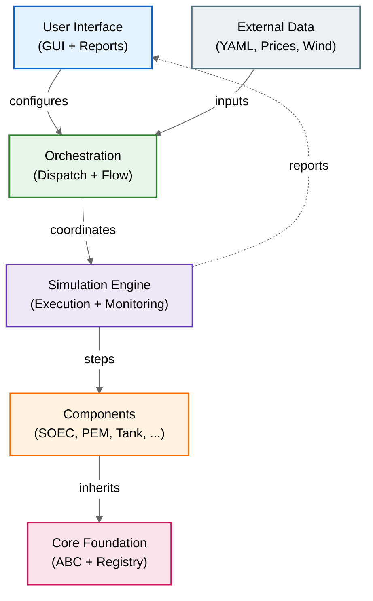
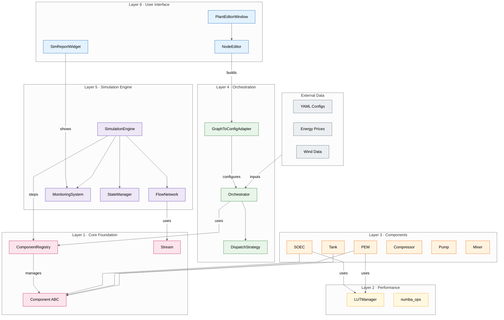
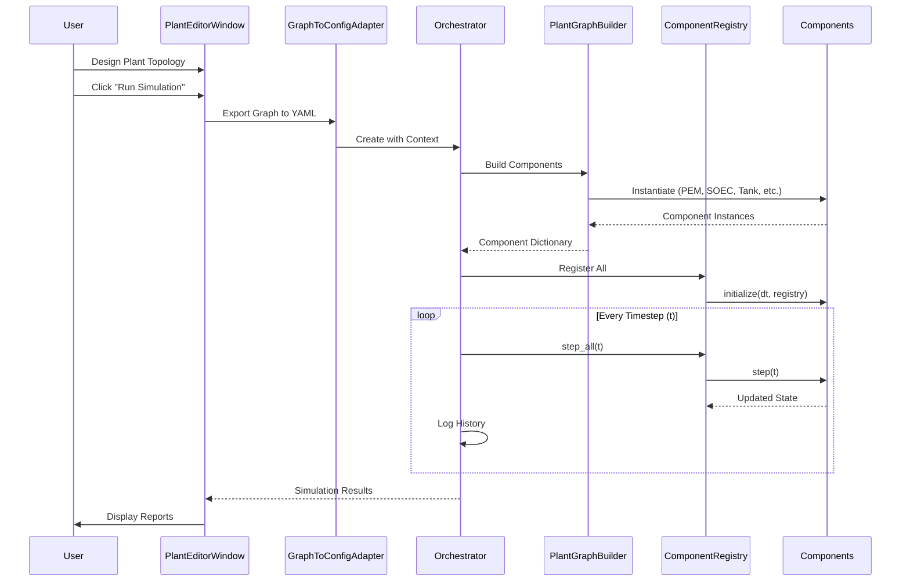
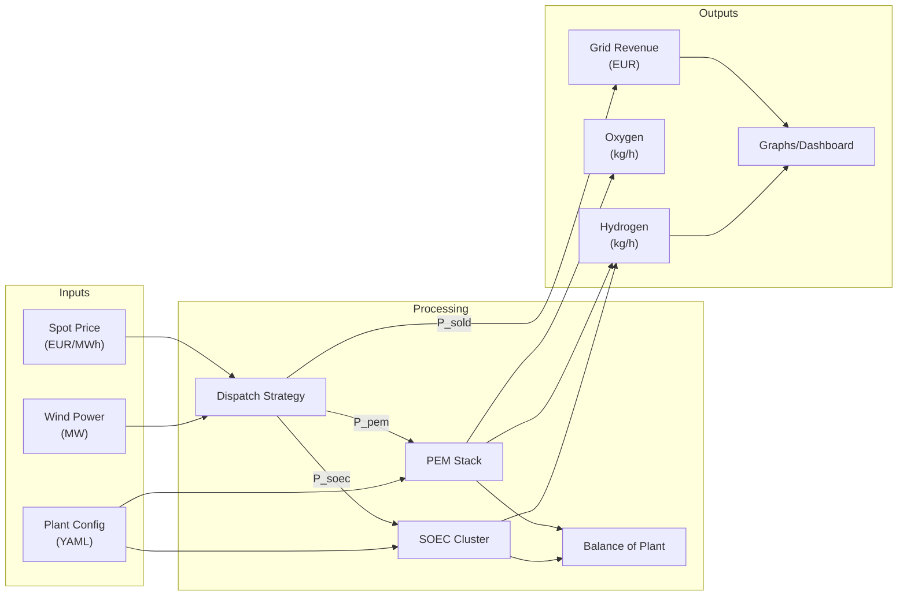

# H2 Plant - Overall System Architecture

A comprehensive view of the Dual-Path Hydrogen Production System's 6-layer architecture.

## High-Level Architecture

---

## Detailed System Layers

### Technology Stack

| Layer | Technologies |
|-------|--------------|
| UI | PySide6, NodeGraphQt, Matplotlib |
| Engine | NumPy, async workers |
| Orchestration | YAML loader, Pydantic |
| Components | CoolProp, SciPy |
| Performance | Numba JIT, LUT caching |
| Core | Python ABC, dataclasses |

## Component Lifecycle Flow

## Data Flow Architecture

## Directory Structure Mapping

| Layer | Directory | Key Files |
|-------|-----------|-----------|
| 6 - UI | `h2_plant/gui/` | `main_window.py`, `nodes/*.py` |
| 5 - Engine | `h2_plant/simulation/` | `engine.py`, `flow_network.py` |
| 4 - Orchestration | `h2_plant/` | `orchestrator.py` |
| 4 - Orchestration | `h2_plant/control/` | `dispatch.py` |
| 3 - Components | `h2_plant/components/` | `electrolysis/`, `storage/`, etc. |
| 2 - Optimization | `h2_plant/optimization/` | `lut_manager.py`, `numba_ops.py` |
| 1 - Core | `h2_plant/core/` | `component.py`, `component_registry.py` |
