# H2 Plant - Overall System Architecture

A comprehensive view of the Dual-Path Hydrogen Production System's 6-layer architecture.

## System Layers Overview

```mermaid
%%{init: {'theme': 'base', 'themeVariables': { 'fontSize': '14px'}}}%%
flowchart TB
    subgraph L6["🖥️ Layer 6: User Interface"]
        direction LR
        GUI["PlantEditorWindow"]
        NodeEditor["NodeEditor"]
        SimReport["SimulationReportWidget"]
    end

    subgraph L5["⚙️ Layer 5: Simulation Engine"]
        direction LR
        Engine["SimulationEngine"]
        FlowNet["FlowNetwork"]
        Monitor["MonitoringSystem"]
    end

    subgraph L4["🎯 Layer 4: Orchestration"]
        direction LR
        Orch["Orchestrator"]
        Dispatch["DispatchStrategy"]
    end

    subgraph L3["🔧 Layer 3: Components"]
        direction LR
        subgraph Electrolysis
            SOEC["SOEC"]
            PEM["PEM"]
        end
        subgraph BoP["Balance of Plant"]
            Tank["Tank"]
            Comp["Compressor"]
            Pump["Pump"]
            Mixer["Mixer"]
        end
    end

    subgraph L2["🚀 Layer 2: Performance"]
        direction LR
        LUT["LUTManager"]
        Numba["numba_ops"]
    end

    subgraph L1["📦 Layer 1: Core Foundation"]
        direction LR
        CompABC["Component ABC"]
        Registry["ComponentRegistry"]
        Stream["Stream"]
    end

    %% Layer connections (vertical flow)
    L6 --> L5
    L5 --> L4
    L4 --> L3
    L3 --> L2
    L3 --> L1
    L2 --> L1

    %% Style
    style L6 fill:#e1f5fe,stroke:#0288d1
    style L5 fill:#fff3e0,stroke:#ff9800
    style L4 fill:#f3e5f5,stroke:#9c27b0
    style L3 fill:#e8f5e9,stroke:#4caf50
    style L2 fill:#fff8e1,stroke:#ffc107
    style L1 fill:#fce4ec,stroke:#e91e63
```

### Layer Details

| Layer | Purpose | Key Classes |
|-------|---------|-------------|
| **6 - UI** | Visual configuration & reports | `PlantEditorWindow`, `NodeEditor`, `SimulationReportWidget` |
| **5 - Engine** | Execution & monitoring | `SimulationEngine`, `FlowNetwork`, `MonitoringSystem` |
| **4 - Orchestration** | Coordinate production & arbitrage | `Orchestrator`, `DispatchStrategy` |
| **3 - Components** | Physical simulation entities | `SOEC`, `PEM`, `Tank`, `Compressor`, `Pump`, `Mixer` |
| **2 - Performance** | 50-200x speedup via caching/JIT | `LUTManager`, `numba_ops` |
| **1 - Core** | Standardized interfaces | `Component ABC`, `ComponentRegistry`, `Stream` |

## Component Lifecycle Flow

## Data Flow Architecture

## Directory Structure Mapping

| Layer | Directory | Key Files |
|-------|-----------|-----------|
| 6 - UI | `h2_plant/gui/` | `main_window.py`, `nodes/*.py` |
| 5 - Engine | `h2_plant/simulation/` | `engine.py`, `flow_network.py` |
| 4 - Orchestration | `h2_plant/` | `orchestrator.py` |
| 4 - Orchestration | `h2_plant/control/` | `dispatch.py` |
| 3 - Components | `h2_plant/components/` | `electrolysis/`, `storage/`, etc. |
| 2 - Optimization | `h2_plant/optimization/` | `lut_manager.py`, `numba_ops.py` |
| 1 - Core | `h2_plant/core/` | `component.py`, `component_registry.py` |
