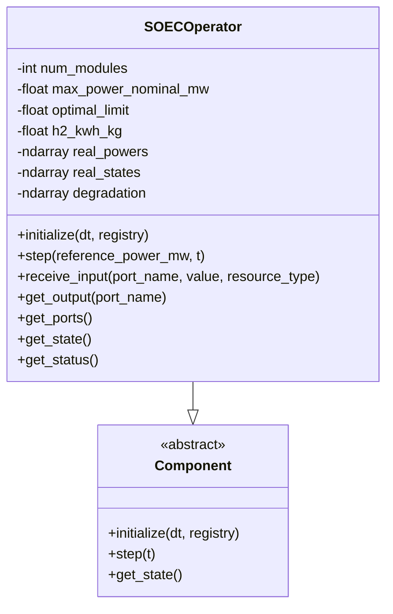
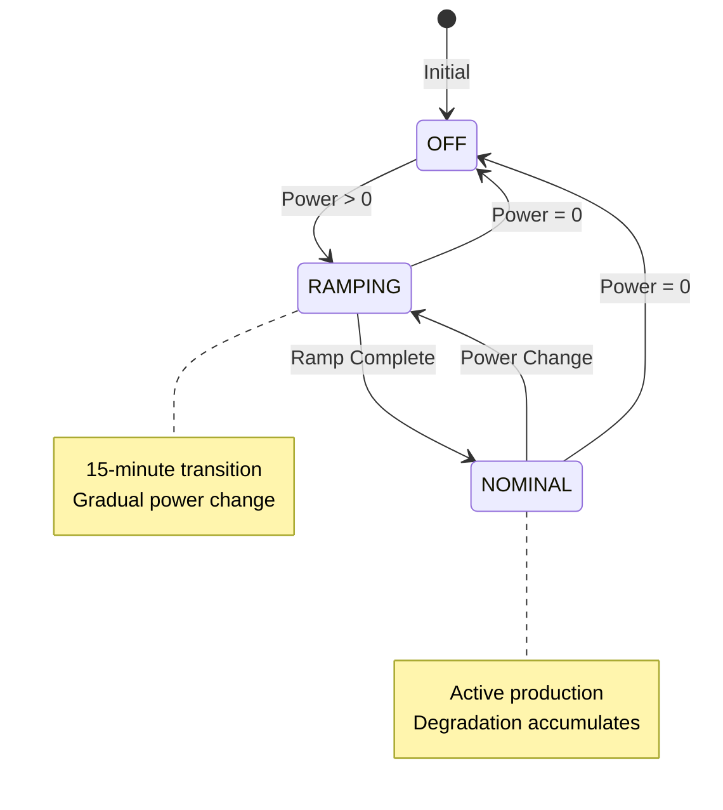
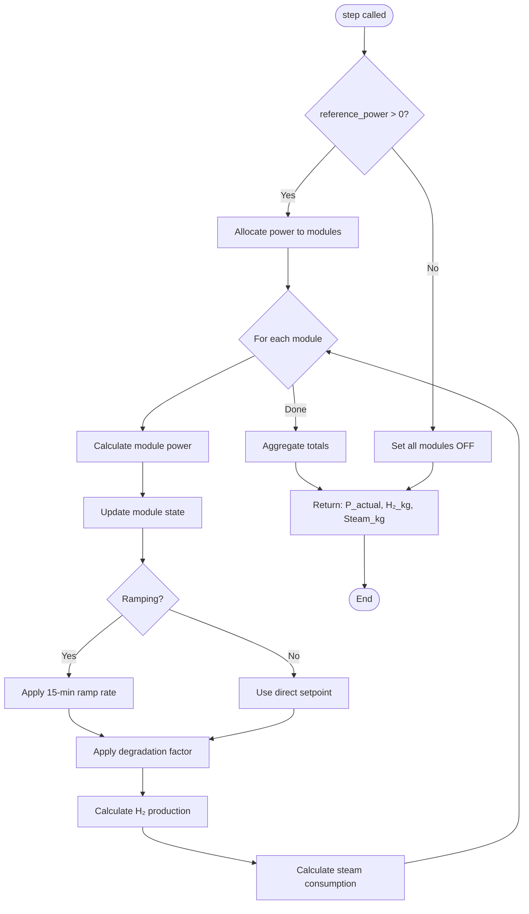
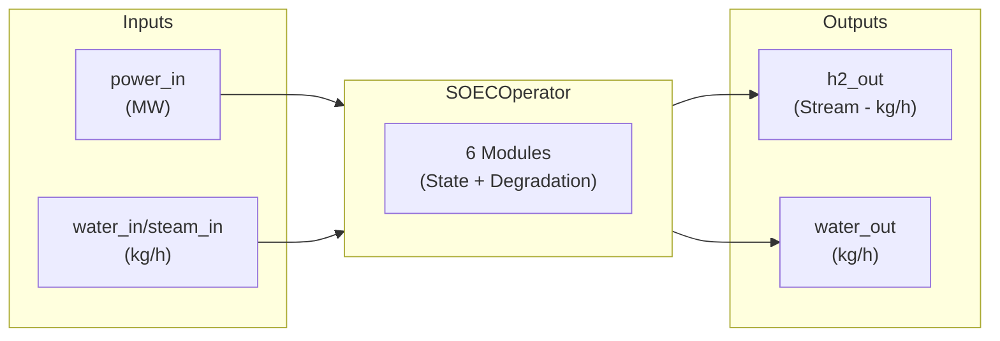
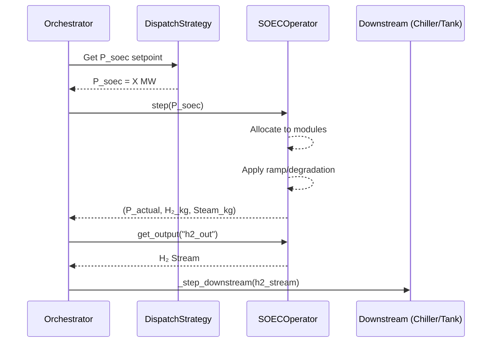

# SOEC Electrolyzer Component Diagram

Detailed architecture of the Solid Oxide Electrolyzer Cell (SOEC) Operator component.

## Component Overview

## Module State Machine

## Step Execution Flow

## Input/Output Ports

## Key Parameters

| Parameter | Default | Description |
|-----------|---------|-------------|
| `num_modules` | 6 | Number of SOEC modules |
| `max_power_nominal_mw` | 8.0 | Max power per module (MW) |
| `optimal_limit` | 0.8 | Operating limit factor |
| `h2_kwh_kg` | 37.5 | Energy per kg H₂ produced |
| `ramp_time_min` | 15 | Time to ramp up/down |

## Integration with Orchestrator

