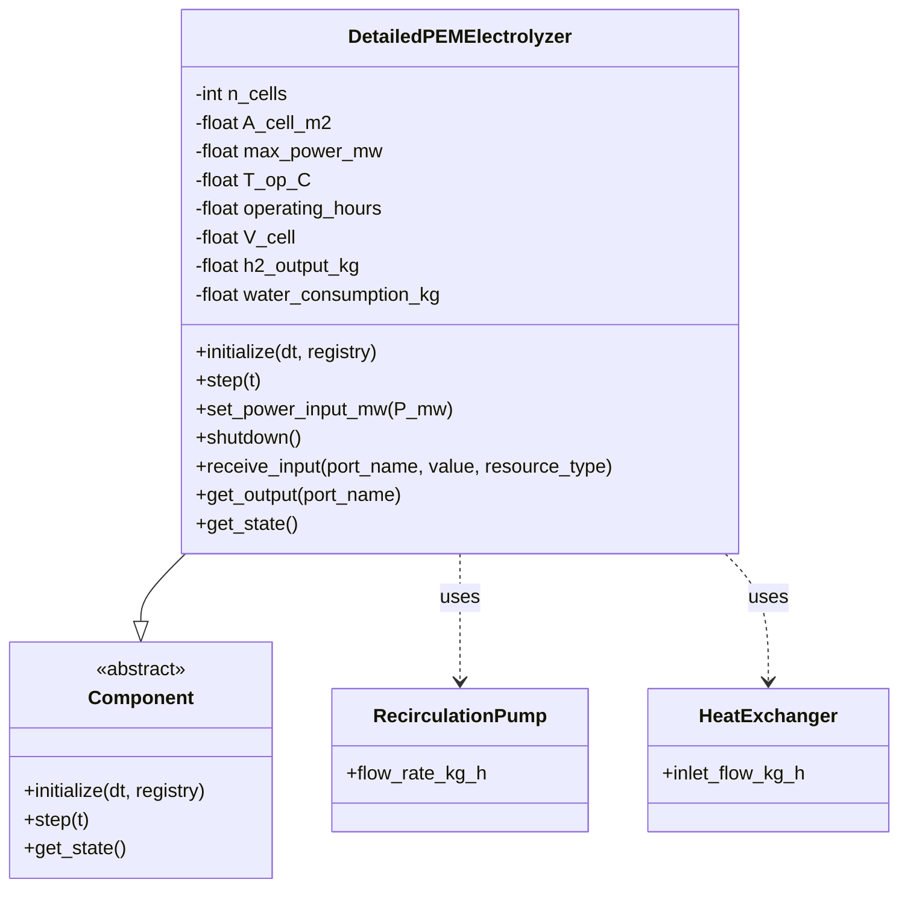
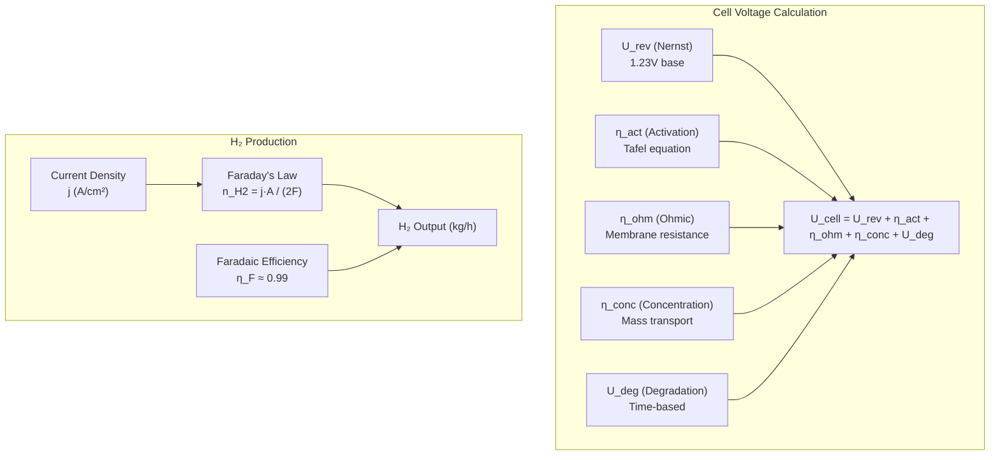
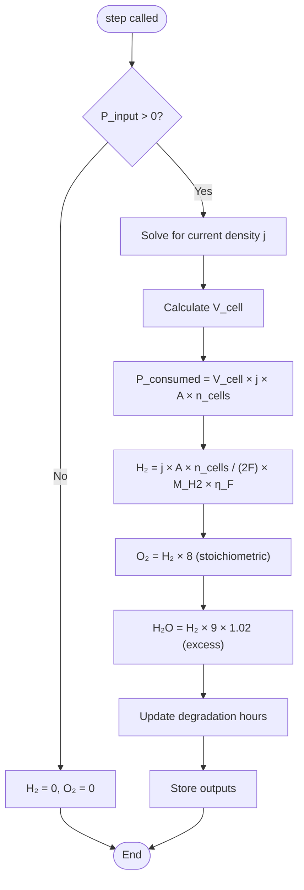
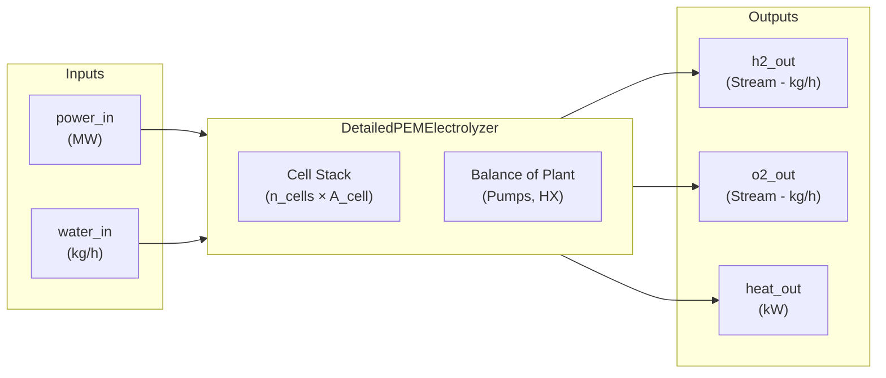
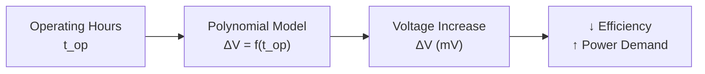
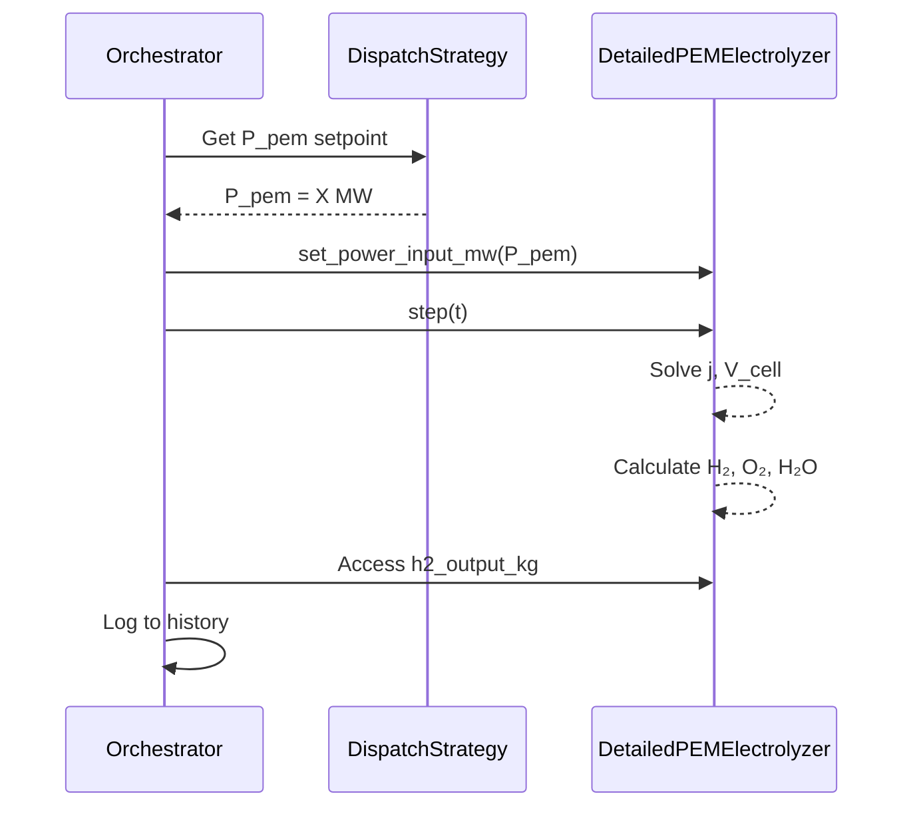

# PEM Electrolyzer Component Diagram

Detailed architecture of the Proton Exchange Membrane (PEM) Electrolyzer component.

## Component Overview

## Electrochemistry Model

## Step Execution Flow

## Input/Output Ports

## Key Parameters

| Parameter | Default | Description |
|-----------|---------|-------------|
| `N_stacks` | 35 | Number of stacks |
| `N_cell_per_stack` | 85 | Cells per stack |
| `A_cell` | 300 cm² | Active cell area |
| `max_power_mw` | 5.0 | Maximum input power |
| `T_op` | 333.15 K (60°C) | Operating temperature |
| `P_op` | 40 bar | Operating pressure |

## Degradation Model

| Time (hours) | Degradation (mV) |
|--------------|------------------|
| 0 | 0 |
| 5,000 | ~5 |
| 10,000 | ~15 |
| 20,000 | ~40 |

## Integration with Orchestrator

