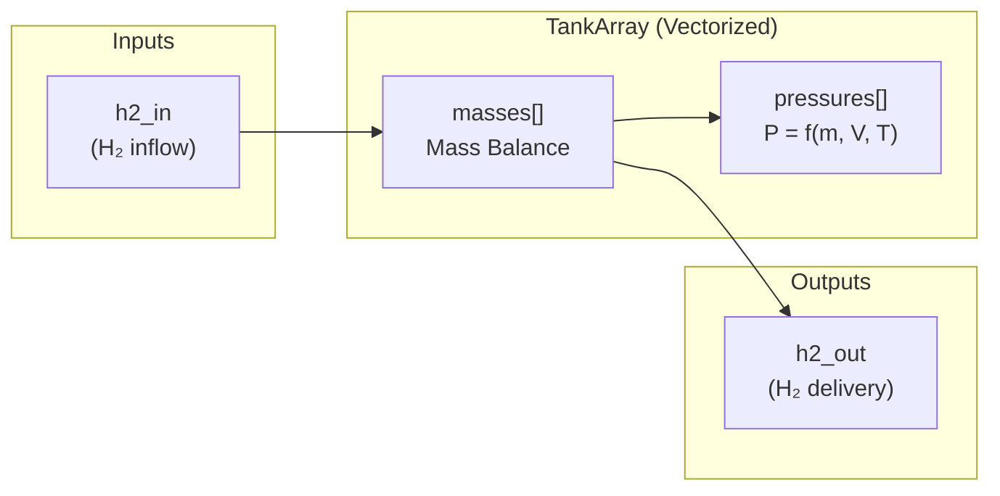
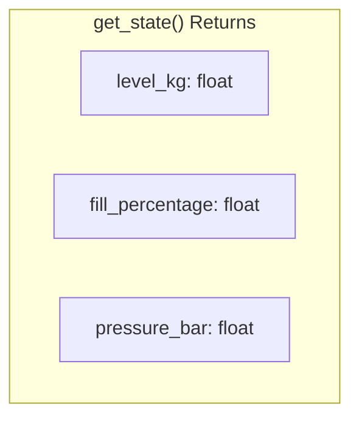
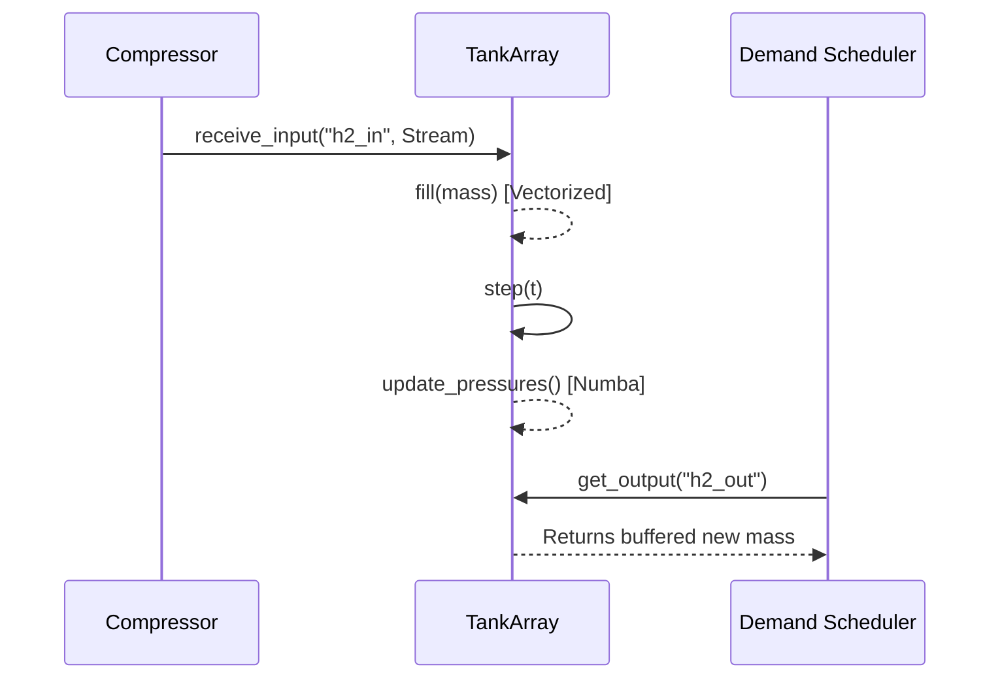

# Storage Component Diagram

Detailed architecture of the Tank/Storage component for hydrogen storage.

## Component Overview

```mermaid
    class TankArray {
        -int n_tanks
        -float capacity_kg (per tank)
        -float[] masses
        -float[] pressures
        -int[] states
        +initialize(dt, registry)
        +step(t)
        +fill(mass_kg)
        +discharge(mass_kg)
        +get_state()
    }
    
    class Component {
        <<abstract>>
        +initialize(dt, registry)
        +step(t)
        +get_state()
    }
    
    TankArray --|> Component
```

## Mass Balance Model



## Step Execution Flow


## Key Parameters

| Parameter | Default | Description |
|-----------|---------|-------------|
| `capacity_kg` | 1000.0 | Maximum storage capacity |
| `initial_level_kg` | 0.0 | Starting fill level |
| `min_level_ratio` | 0.05 | Minimum operational level (5%) |
| `max_pressure_bar` | 200.0 | Maximum pressure at full capacity |

## State Output



## Integration Example


