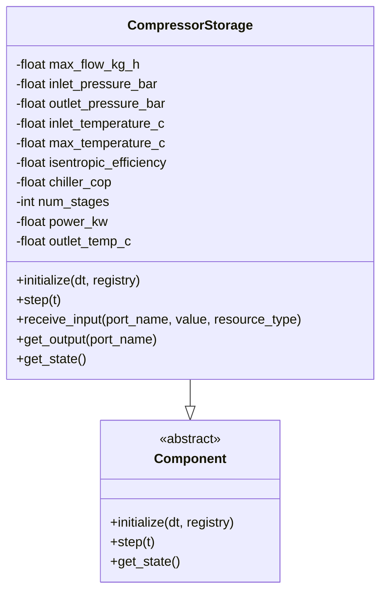
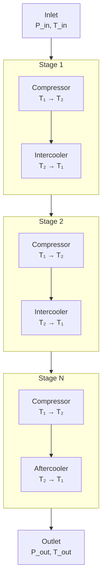
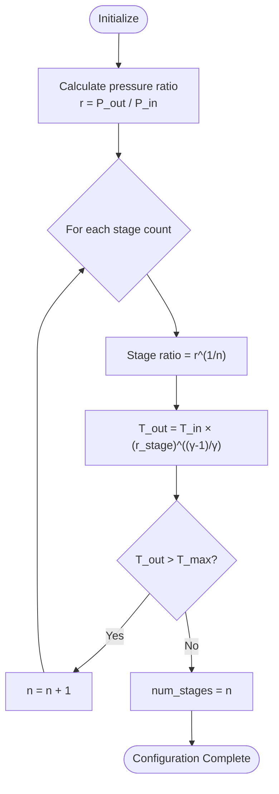
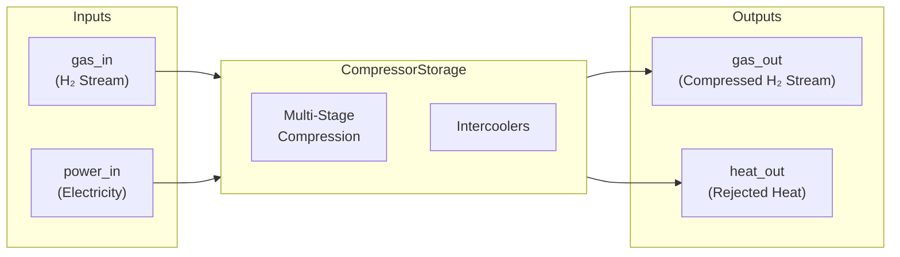
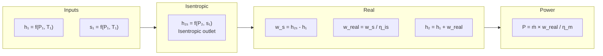
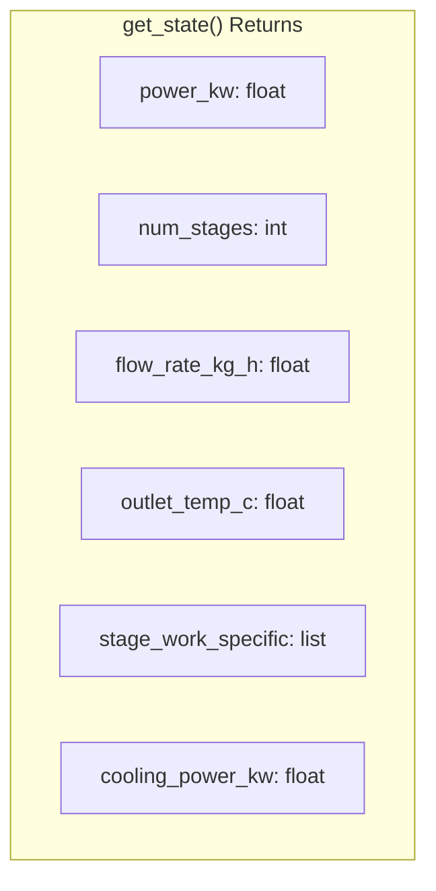

# Compressor Component Diagram

Detailed architecture of the multi-stage hydrogen compressor component.

## Component Overview

## Multi-Stage Compression Model

## Stage Configuration Logic

## Input/Output Ports

## Key Parameters

| Parameter | Default | Description |
|-----------|---------|-------------|
| `max_flow_kg_h` | - | Maximum mass flow rate |
| `inlet_pressure_bar` | 1.0 | Suction pressure |
| `outlet_pressure_bar` | 200.0 | Discharge pressure |
| `inlet_temperature_c` | 10.0 | Suction temperature |
| `max_temperature_c` | 85.0 | Max discharge temp per stage |
| `isentropic_efficiency` | 0.65 | Compression efficiency |
| `chiller_cop` | 3.0 | Intercooler COP |

## Thermodynamic Calculations

## State Output

