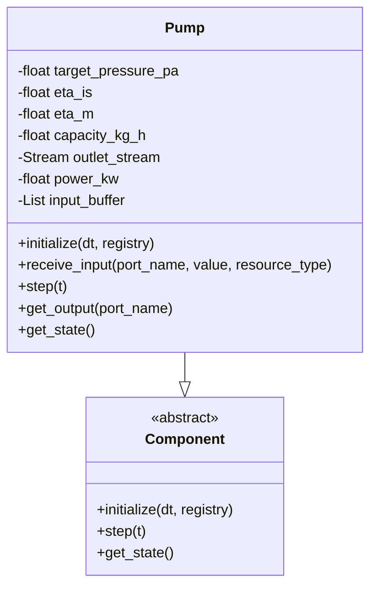
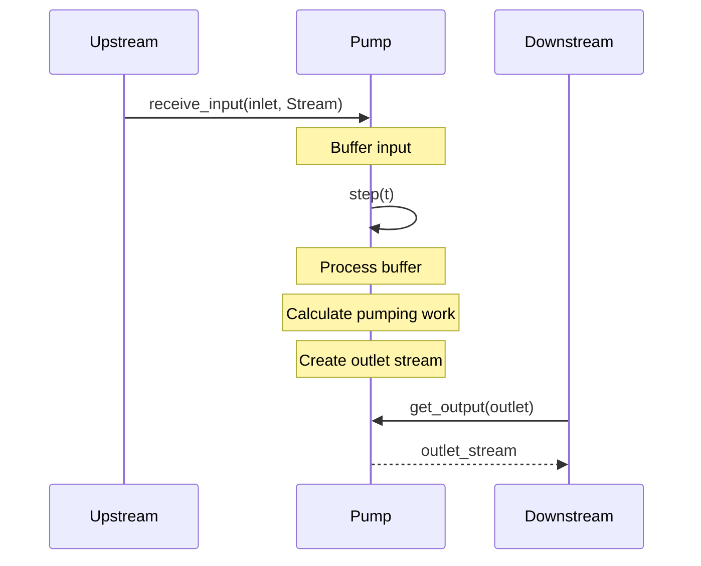
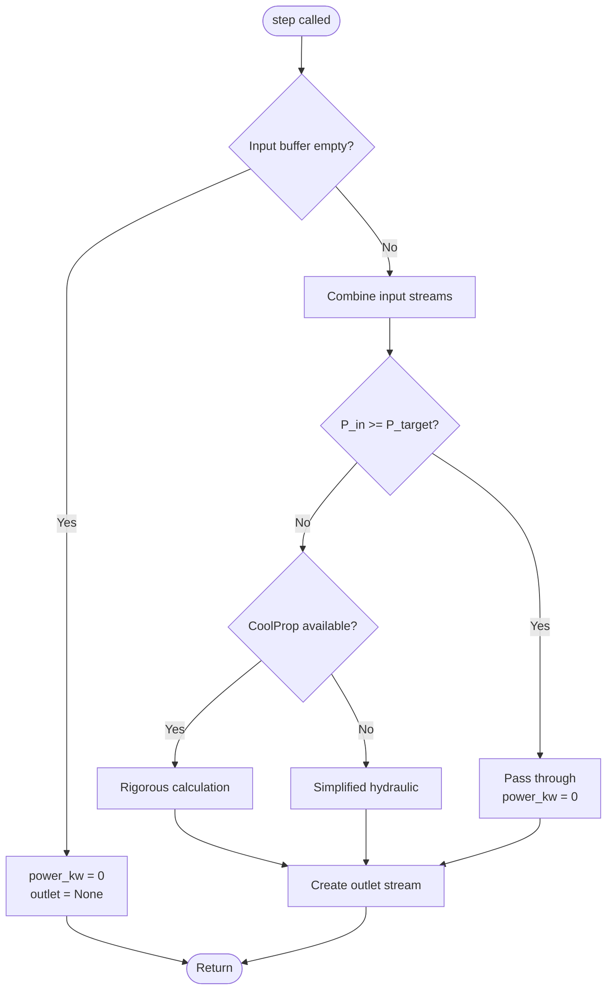
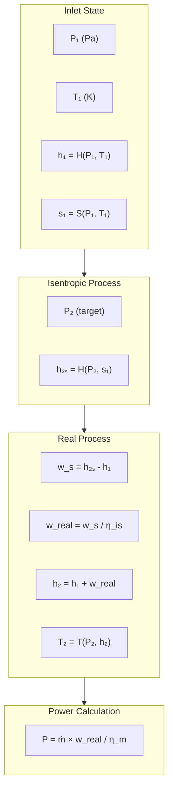
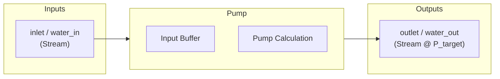
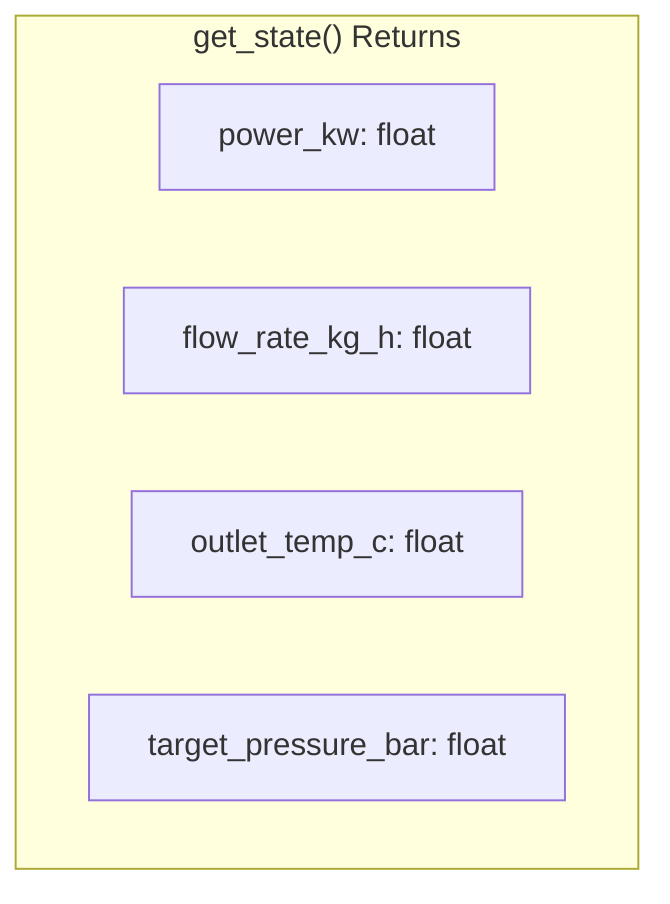

# Pump Component Diagram

Detailed architecture of the water pump component with rigorous thermodynamics.

## Component Overview



## Push Architecture Flow



## Step Execution Flow



## Thermodynamic Calculation (CoolProp)



## Input/Output Ports



## Key Parameters

| Parameter | Default | Description |
|-----------|---------|-------------|
| `target_pressure_bar` | - | Target outlet pressure |
| `eta_is` | 0.82 | Isentropic efficiency |
| `eta_m` | 0.96 | Mechanical efficiency |
| `capacity_kg_h` | 1000.0 | Maximum flow capacity |

## State Output



## Simplified Fallback

When CoolProp is unavailable:

```
Hydraulic Power = V̇ × ΔP
Shaft Power = Hydraulic Power / (η_is × η_m)

where:
  V̇ = mass flow / density (ρ ≈ 1000 kg/m³)
  ΔP = P_target - P_inlet
```
