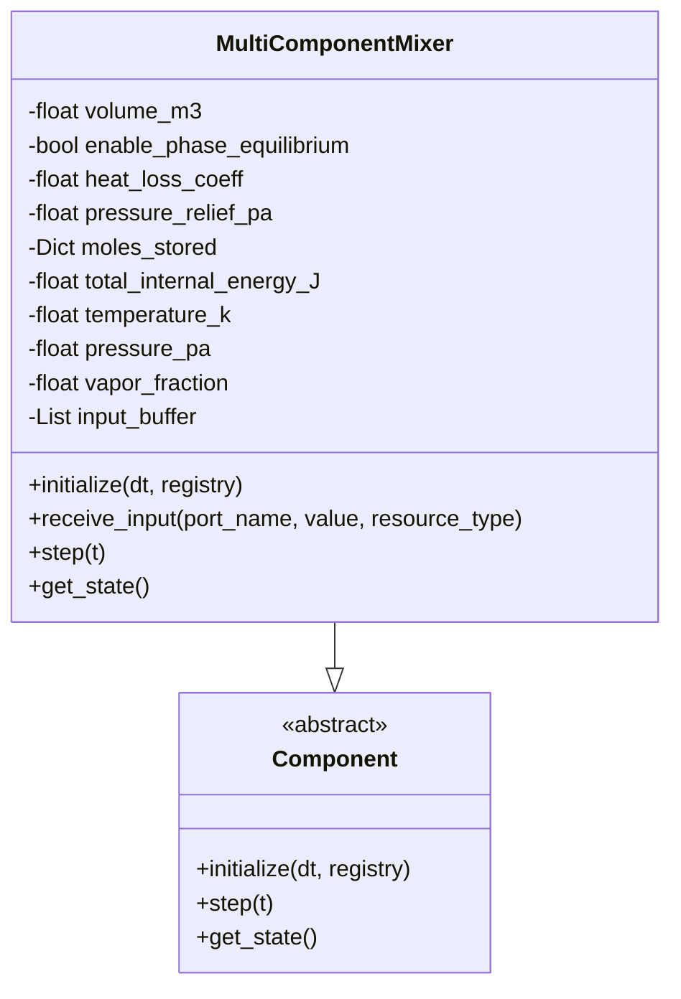
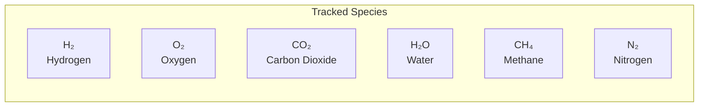
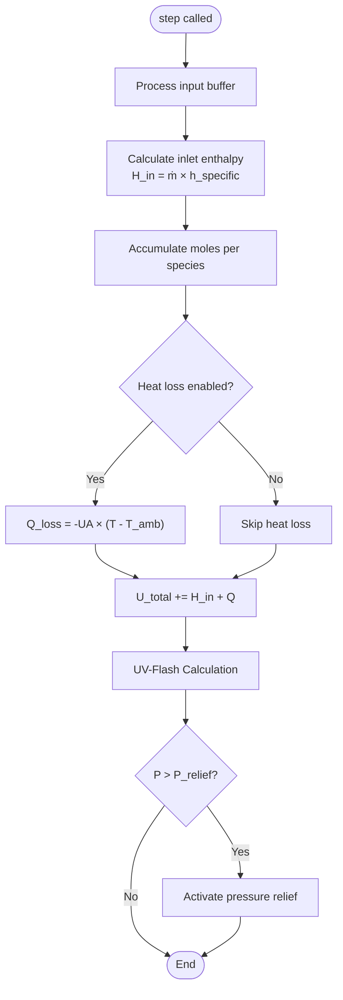
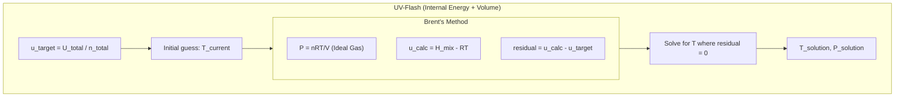
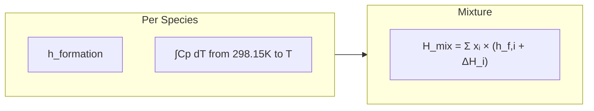
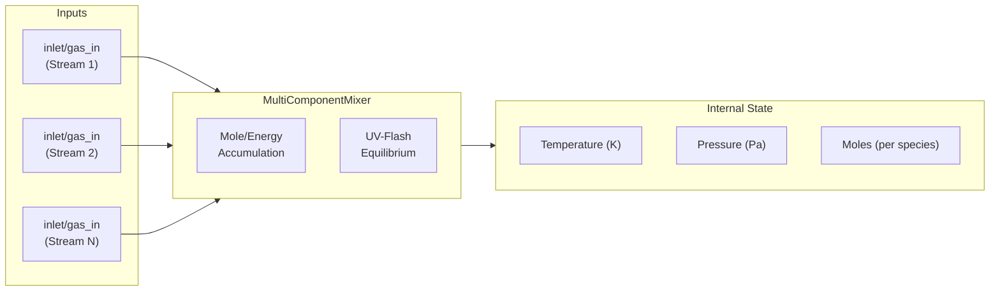
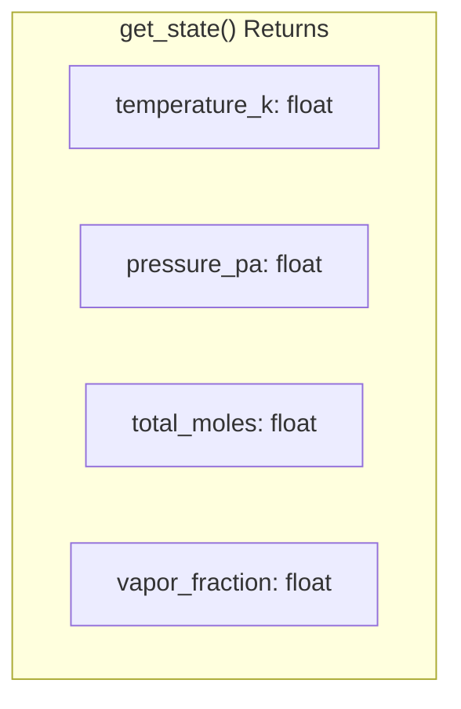
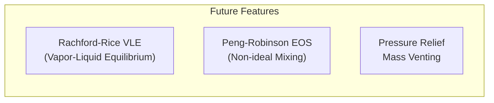

# Mixer Component Diagram

Detailed architecture of the multi-component gas mixer with thermodynamic calculations.

## Component Overview



## Supported Species



## Step Execution Flow



## UV-Flash Algorithm



## Enthalpy Calculation



**Cp Integration (Shomate Equation):**
```
Cp = A + BT + CT² + DT³ + E/T²
∫Cp dT = AT + ½BT² + ⅓CT³ + ¼DT⁴ - E/T
```

## Input/Output Ports



## Key Parameters

| Parameter | Default | Description |
|-----------|---------|-------------|
| `volume_m3` | - | Mixer vessel volume |
| `enable_phase_equilibrium` | true | Enable VLE calculations |
| `heat_loss_coeff_W_per_K` | 0.0 | UA for heat loss |
| `pressure_relief_threshold_bar` | 50.0 | Relief valve setpoint |
| `initial_temperature_k` | 298.15 | Starting temperature |

## State Output



## Future Enhancements


