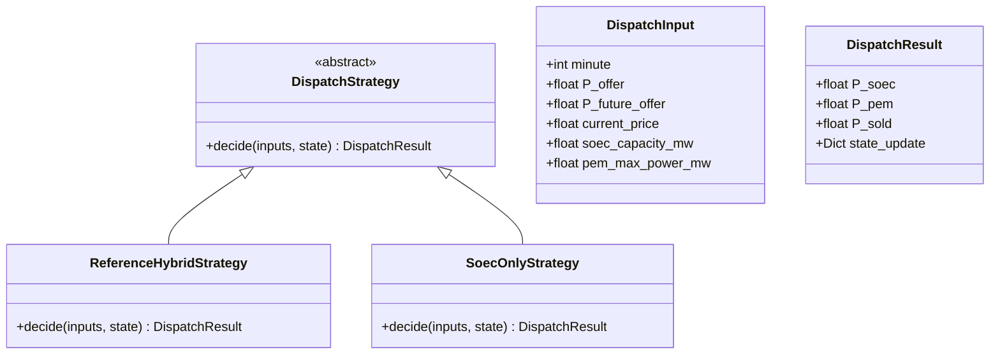
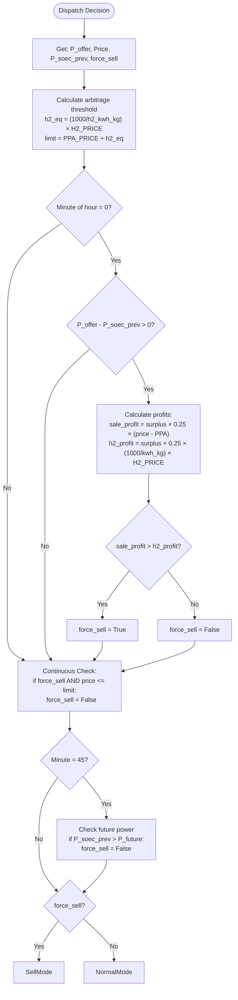
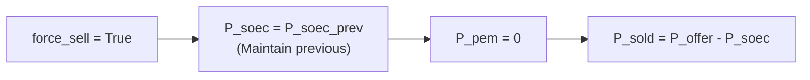
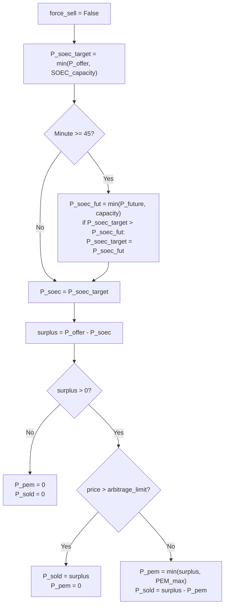
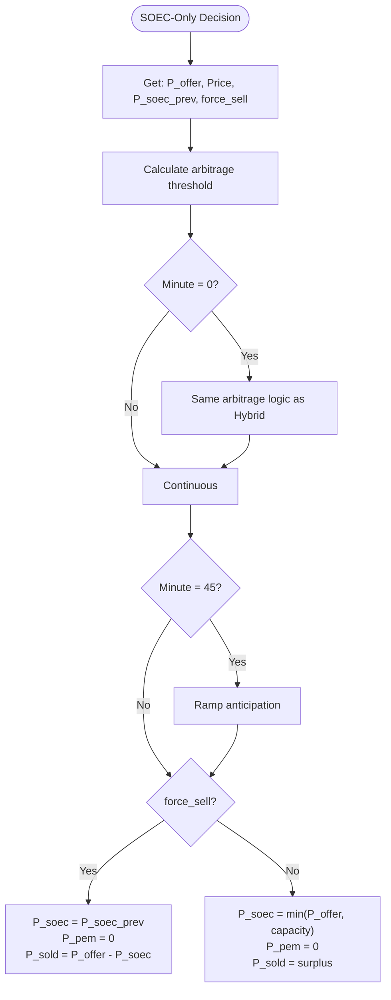
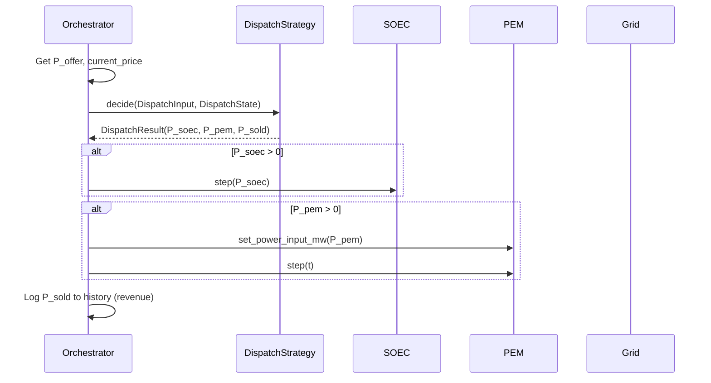

# Arbitration Logic Diagrams

Detailed flowcharts for the dispatch strategies that control power allocation between electrolyzers and grid sales.

## Overview



---

## ReferenceHybridStrategy

The main arbitration logic for hybrid SOEC+PEM systems.

### Decision Flowchart



### Force Sell Mode



### Normal Operation Mode



---

## SoecOnlyStrategy

Simplified strategy for SOEC-only topologies.

### Decision Flowchart



---

## Key Constants

| Constant | Value | Description |
|----------|-------|-------------|
| `PPA_PRICE` | 50.0 EUR/MWh | Power Purchase Agreement price |
| `H2_PRICE_KG` | 9.6 EUR/kg | Hydrogen selling price |
| `SOEC_H2_KWH_KG` | 37.5 kWh/kg | SOEC energy per kg H₂ |
| `PEM_H2_KWH_KG` | 50.0 kWh/kg | PEM energy per kg H₂ |

## Arbitrage Threshold Calculation

```
h2_equivalent_price = (1000 kWh/MWh) / (h2_kwh_kg) × H2_PRICE_KG
                    = (1000 / 37.5) × 9.6
                    = 256 EUR/MWh

arbitrage_limit = PPA_PRICE + h2_equivalent_price
                = 50 + 256
                = 306 EUR/MWh
```

**Interpretation:** If spot price exceeds 306 EUR/MWh, it's more profitable to sell electricity than to produce hydrogen.

## Integration with Orchestrator


