# GUI Structure Diagrams

Detailed architecture of the graphical user interface components.

## Main Window Architecture

## Window Layout

---

## Node Editor Workflow

## Available Node Types

---

## Simulation Report Flow

## Lazy Loading Architecture

## Graph Categories

```mermaid
flowchart TB
    subgraph Tree["Graph Selection Tree"]
        Production["📈 Production"]
        Economics["💰 Economics"]
        Components["🔧 Components"]
        Advanced["📊 Advanced"]
    end
    
    subgraph ProductionGraphs["Production Graphs"]
        p1["H₂ Production Rate"]
        p2["Cumulative H₂"]
        p3["SOEC vs PEM Split"]
    end
    
    subgraph EconomicsGraphs["Economics Graphs"]
        e1["Revenue Analysis"]
        e2["Arbitrage Decisions"]
        e3["Price vs Production"]
    end
    
    subgraph ComponentGraphs["Component Graphs"]
        c1["Tank Levels"]
        c2["Compressor Power"]
        c3["Electrolyzer Efficiency"]
    end
    
    Production --> ProductionGraphs
    Economics --> EconomicsGraphs
    Components --> ComponentGraphs
```

---

## Figure Cache Strategy

## Key UI Components

| Component | File | Purpose |
|-----------|------|---------|
| `PlantEditorWindow` | `main_window.py` | Main application window |
| `AllNodesListWidget` | `main_window.py` | Node palette with drag-drop |
| `SimulationReportWidget` | `main_window.py` | Report display with lazy loading |
| `GraphWorker` | `main_window.py` | Background graph generation |
| `FigureCache` | `main_window.py` | LRU cache for figures |
| `LazyGraphSlot` | `main_window.py` | Placeholder for lazy graphs |
| `AdvancedValidator` | `advanced_validation.py` | Topology validation |
| `GraphPersistenceManager` | `graph_persistence.py` | Save/load .h2plant files |
