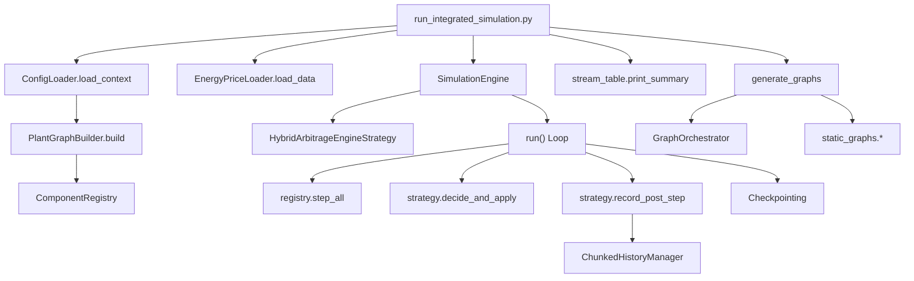

# Software Architecture File Reference

This document maps each section of the software architecture documentation to the specific source files that implement them.

---

## 6.1 - Conceptual Software Architecture

### Setup Phase (Initialization & Graph Building)

| File | Lines | Key Classes/Functions |
|------|-------|----------------------|
| `h2_plant/config/loader.py` | 74 | `ConfigLoader`, `load_context()` |
| `h2_plant/config/models.py` | 81 | `SimulationContext`, `TopologyConfig`, `PhysicsConfig`, `SimulationConfig`, `EconomicsConfig`, `ComponentNode`, `NodeConnection` |
| `h2_plant/core/graph_builder.py` | 544 | `PlantGraphBuilder`, `build()`, `_create_component_by_type()` |

### Motor Phase (Simulation Engine)

| File | Lines | Key Classes/Functions |
|------|-------|----------------------|
| `h2_plant/simulation/engine.py` | 547 | `SimulationEngine`, `run()`, `initialize()`, `_save_checkpoint()`, `_resume_from_checkpoint()` |
| `h2_plant/run_integrated_simulation.py` | 929 | `run_with_dispatch_strategy()`, `generate_graphs()` |

### Results Phase (Reporting & Visualization)

| File | Lines | Key Classes/Functions |
|------|-------|----------------------|
| `h2_plant/reporting/stream_table.py` | 273 | `print_stream_summary_table()` |
| `h2_plant/visualization/static_graphs.py` | 4656 | 95+ graph functions: `create_dispatch_figure`, `create_h2_production_figure`, `create_cumulative_h2_figure`, etc. |

---

## 6.2 - Detailed Architecture of Modules

### Model Builder

| File | Lines | Key Classes/Functions |
|------|-------|----------------------|
| `h2_plant/core/graph_builder.py` | 544 | `PlantGraphBuilder._create_component_by_type()` – 420+ line factory switch |
| `h2_plant/core/component_registry.py` | 333 | `ComponentRegistry`, `register()`, `get()`, `get_by_type()`, `initialize_all()`, `step_all()` |

### Data Loader

| File | Lines | Key Classes/Functions |
|------|-------|----------------------|
| `h2_plant/data/price_loader.py` | 109 | `EnergyPriceLoader`, `load_data()` |

### Simulation Loop

| File | Lines | Key Classes/Functions |
|------|-------|----------------------|
| `h2_plant/simulation/engine.py` | 547 | `SimulationEngine.run()` (L209-319) – main while loop |

### Event Handler / Dispatch Logic

| File | Lines | Key Classes/Functions |
|------|-------|----------------------|
| `h2_plant/control/engine_dispatch.py` | 1031 | `HybridArbitrageEngineStrategy`, `decide_and_apply()`, `record_post_step()`, `StreamRecorder` |

### Aggregator (History Recording)

| File | Lines | Key Classes/Functions |
|------|-------|----------------------|
| `h2_plant/storage/history_manager.py` | 503 | `ChunkedHistoryManager`, `record()`, `flush()`, `get_dataframe()`, `export_to_csv()`, `HistoryArrayProxy` |

---

## 6.3 - Data Modeling and State Management

### Core Data Models

| File | Lines | Key Classes/Functions |
|------|-------|----------------------|
| `h2_plant/core/component.py` | 290 | `Component` (ABC): `initialize()`, `step()`, `get_state()`, `receive_input()`, `get_output()`, `get_ports()` |
| `h2_plant/core/stream.py` | 503 | `Stream` (@dataclass): mass_flow, T, P, composition, `mix_with()`, `compress_isentropic()`, `mole_fractions`, `specific_enthalpy_j_kg`, `density_kg_m3` |
| `h2_plant/core/constants.py` | 360 | `GasConstants`, `StandardConditions`, `ConversionFactors`, `DeoxoConstants`, `DryCoolerIndirectConstants`, etc. |

### State Optimization (LUT Architecture)

| File | Lines | Key Classes/Functions |
|------|-------|----------------------|
| `h2_plant/optimization/lut_manager.py` | 1126 | `LUTManager`, `LUTConfig`, `initialize()`, `lookup()`, `lookup_batch()`, `lookup_mixture_enthalpy()` |
| `h2_plant/optimization/numba_ops.py` | 2831 | 64+ JIT functions: `calculate_stream_enthalpy_jit`, `calculate_compression_work`, `counter_flow_ntu_effectiveness`, `solve_rachford_rice_single_condensable`, etc. |

### Component Physics (Representative Examples)

| Subdirectory | Files | Examples |
|--------------|-------|----------|
| `components/electrolysis/` | 2 | `soec.py`, `pem_electrolyzer.py` |
| `components/compression/` | 3 | `compressor_single.py` |
| `components/cooling/` | 2 | `dry_cooler.py`, `chiller.py` |
| `components/separation/` | 8 | `knock_out_drum.py`, `hydrogen_cyclone.py`, `coalescer.py`, `psa_syngas.py` |
| `components/storage/` | 7 | `detailed_tank.py` |
| `components/thermal/` | 8 | `interchanger.py`, `attemperator.py` |

---

## 6.4 - Input and Output Interface (UI/UX) Design

### Input Interface (Configuration-as-Code)

| File | Purpose |
|------|---------|
| `scenarios/simulation_config.yaml` | Duration, timestep, data file paths, dispatch strategy |
| `scenarios/plant_topology.yaml` | Node definitions + connections (1760+ lines) |
| `scenarios/visualization_config.yaml` | Graph enable/disable, export settings |
| `scenarios/physics_parameters.yaml` | SOEC/PEM specs |
| `scenarios/economics_parameters.yaml` | H2 prices, PPA config |

### Output Interface

| File | Lines | Key Classes/Functions |
|------|-------|----------------------|
| `h2_plant/visualization/graph_orchestrator.py` | 154 | `GraphOrchestrator`, `generate_all()` |
| `h2_plant/visualization/dashboard_generator.py` | ~400 | `DashboardGenerator`: HTML dashboard creation |
| `h2_plant/visualization/static_graphs.py` | 4656 | Individual `create_*_figure()` functions |
| `visualization/graphs/` submodules | — | `profiles.py`, `thermal.py`, `separation.py`, `economics.py`, `production.py`, `performance.py`, `soec.py`, `storage.py` |

---

## Execution Flow Diagram

---

## 7.1 - Development Environment

### Language & Runtime

| Item | Value |
|------|-------|
| Language | Python 3.9+ |
| Package Manager | pip / setuptools |

### Core Project Files

| File | Lines | Purpose |
|------|-------|---------|
| `pyproject.toml` | 88 | Build system, dependencies, pytest/coverage/mypy/black config |
| `requirements.txt` | 19 | Runtime dependencies with version constraints |
| `setup.py` | — | Legacy compatibility for `pip install -e .` |

### Key Libraries

| Library | Purpose | Version |
|---------|---------|---------|
| **NumPy** | Array operations, numerical computing | `>=1.24.0,<2.0.0` |
| **Numba** | JIT compilation for hot paths | `>=0.57.0` |
| **CoolProp** | Thermodynamic property tables | `>=6.4.0` |
| **Pandas** | Time-series data handling, history export | `>=2.0.0` |
| **Pydantic** | Configuration validation & data classes | `>=2.0.0` |
| **PyYAML** | YAML configuration parsing | `>=6.0` |
| **Matplotlib** | Static graph generation | `>=3.5.0` |
| **Plotly** | Interactive visualization | `>=5.0.0` |
| **Pytest** | Testing framework | `>=7.0.0` |
| **SciPy** | Scientific computing, optimization | `>=1.9.0` |

---

## 7.2 - Implementation of Core Simulation Engine

### Main Engine Loop

| File | Lines | Key Classes/Functions |
|------|-------|----------------------|
| `h2_plant/simulation/engine.py` | 547 | `SimulationEngine.run()` (L209-319): main `while` loop, timestep iteration |
| `h2_plant/simulation/engine.py` | — | `SimulationEngine.initialize()` (L140-207): component initialization, execution order |
| `h2_plant/core/component_registry.py` | 333 | `ComponentRegistry.step_all()` (L258-295): ordered component stepping |

### Key Algorithms

| Algorithm | File | Function | Lines |
|-----------|------|----------|-------|
| Polytropic Compression | `h2_plant/optimization/numba_ops.py` | `calculate_compression_work()` | L242-286 |
| Real-Gas Compression | `h2_plant/optimization/numba_ops.py` | `calculate_compression_realgas_jit()` | ~L800-900 |
| ε-NTU Heat Transfer | `h2_plant/optimization/numba_ops.py` | `counter_flow_ntu_effectiveness()` | ~L1200 |
| Flash Calculation | `h2_plant/optimization/numba_ops.py` | `solve_rachford_rice_single_condensable()` | ~L1400 |
| Bilinear Interpolation | `h2_plant/optimization/numba_ops.py` | `bilinear_interp_jit()` | ~L600 |
| Stream Mixing | `h2_plant/core/stream.py` | `Stream.mix_with()` | L371-441 |
| Enthalpy Calculation | `h2_plant/core/stream.py` | `_compute_specific_enthalpy()` | L111-148 |
| Mixture Enthalpy | `h2_plant/optimization/mixture_thermodynamics.py` | `get_mixture_enthalpy()` | L46-82 |
| Isentropic Compression | `h2_plant/optimization/mixture_thermodynamics.py` | `solve_isentropic_outlet_temperature()` | L206-288 |

### Component Lifecycle Contract

| File | Lines | Key Classes/Functions |
|------|-------|----------------------|
| `h2_plant/core/component.py` | 290 | `Component` ABC: `initialize()`, `step()`, `get_state()`, `receive_input()`, `get_output()` |

---

## 7.3 - Integration of Physical and Economic Models

### Physical Models (Component Implementations)

| Component Type | File | Lines | Key Physics |
|----------------|------|-------|-------------|
| SOEC Electrolyzer | `h2_plant/components/electrolysis/soec.py` | ~600 | Module ramping, degradation, steam conversion |
| PEM Electrolyzer | `h2_plant/components/electrolysis/pem_electrolyzer.py` | ~350 | Polynomial efficiency curves |
| Compressor | `h2_plant/components/compression/compressor_single.py` | ~400 | Temperature-limited compression, real-gas EOS |
| Dry Cooler | `h2_plant/components/cooling/dry_cooler.py` | 616 | ε-NTU method, condensation flash |
| Chiller | `h2_plant/components/thermal/chiller.py` | ~250 | Sub-ambient cooling |
| KOD | `h2_plant/components/separation/knock_out_drum.py` | ~350 | Gravity separation, liquid holdup |
| Cyclone | `h2_plant/components/separation/hydrogen_cyclone.py` | ~300 | Centrifugal separation efficiency |
| Coalescer | `h2_plant/components/separation/coalescer.py` | ~250 | Permeability-based pressure drop |
| PSA | `h2_plant/components/separation/psa_syngas.py` | ~400 | Recovery rate, purity spec |
| Deoxo Reactor | `h2_plant/components/purification/deoxo_reactor.py` | ~500 | Arrhenius kinetics, adiabatic temperature rise |
| Storage Tank | `h2_plant/components/storage/detailed_tank.py` | ~700 | Real-gas EOS, APC control zones |
| Interchanger | `h2_plant/components/thermal/interchanger.py` | ~350 | Counter-flow, phase change |
| Valve | `h2_plant/components/control/valve.py` | ~300 | Pressure regulation, choked flow |
| Water Tracker | `h2_plant/components/water/water_balance_tracker.py` | ~215 | Mass conservation monitoring |
| Discharge Station | `h2_plant/components/delivery/discharge_station.py` | ~425 | Discrete event truck logistics |
| External Sources | `h2_plant/components/external/*.py` | — | Boundary conditions (Water, Biogas, etc.) |

### Economic / Dispatch Models

| File | Lines | Key Classes/Functions |
|------|-------|----------------------|
| `h2_plant/control/engine_dispatch.py` | 1031 | `HybridArbitrageEngineStrategy.decide_and_apply()` (L582-752): price arbitrage, storage APC |
| `h2_plant/control/engine_dispatch.py` | — | `_determine_zone()` (L515-550): SOC-based control zones |
| `h2_plant/control/engine_dispatch.py` | — | `_calculate_action_factor()` (L552-580): power scaling with derivative action |
| `scenarios/economics_parameters.yaml` | ~30 | H2 prices, PPA tiers, grid limits |

### Thermodynamic Property System

| File | Lines | Key Classes/Functions |
|------|-------|----------------------|
| `h2_plant/optimization/lut_manager.py` | 1126 | `LUTManager`: CoolProp cache, bilinear interpolation |
| `h2_plant/optimization/mixture_thermodynamics.py` | 357 | `get_mixture_enthalpy()`, `get_mixture_entropy()`, `get_mixture_density()`, `solve_isentropic_outlet_temperature()`, `calculate_compression_work()` |
| `h2_plant/optimization/coolprop_lut.py` | ~500 | `CoolPropLUT`: table generation |
| `h2_plant/optimization/numba_ops.py` | 2831 | JIT-compiled lookups, flash calculations |

---

## 7.4 - Verification and Unit Testing

### Test Infrastructure

| File | Lines | Purpose |
|------|-------|---------|
| `pyproject.toml` | 88 | `[tool.pytest.ini_options]`: test paths, markers (`slow`, `benchmark`, `integration`) |
| `tests/conftest.py` | ~50 | Pytest fixtures, common test setup |
| `tests/runner.py` | ~80 | Manual test runner for debugging |

### Component Unit Tests

| Test File | Lines | Validates |
|-----------|-------|-----------|
| `tests/test_compressor_single.py` | ~100 | Compression work, temperature rise |
| `tests/test_chiller.py` | ~100 | Cooling capacity, condensation |
| `tests/test_coalescer.py` | ~80 | Pressure drop, separation efficiency |
| `tests/test_knock_out_drum.py` | ~100 | Liquid separation, holdup |
| `tests/test_soec_component.py` | ~100 | Module control, hydrogen output |
| `tests/test_pem_physics.py` | ~40 | Efficiency curves |
| `tests/test_deoxo_solver.py` | ~60 | Kinetics, O2 removal |

### Comparison Tests (Legacy Parity)

| Test File | Lines | Purpose |
|-----------|-------|---------|
| `tests/compare_compressor.py` | ~160 | Compare vs legacy `modelo_compressor.py` |
| `tests/compare_chiller.py` | ~110 | Compare vs legacy chiller model |
| `tests/compare_coalescer.py` | ~85 | Compare vs legacy `modelo_coalescedor.py` |
| `tests/compare_deoxo.py` | ~100 | Compare vs legacy `modleo_do_deoxo.py` |
| `tests/compare_dry_cooler.py` | ~105 | Compare vs legacy `modelo_dry_cooler.py` |
| `tests/compare_kod.py` | ~180 | Compare vs legacy KOD model |
| `tests/compare_psa.py` | ~125 | Compare vs legacy PSA model |

### Integration & Regression Tests

| Test File | Lines | Purpose |
|-----------|-------|---------|
| `tests/test_phase_ab_regression.py` | ~420 | Phase A/B architecture regression |
| `tests/test_phase_c_validation.py` | ~480 | Phase C validation suite |
| `tests/test_h2_compression_train.py` | ~215 | Full 6-stage train integration |
| `tests/test_purification_chain.py` | ~120 | KOD→Cyclone→Coalescer chain |
| `tests/test_24h_simulation.py` | ~200 | Short simulation smoke test |
| `tests/test_full_simulation.py` | ~35 | Full run smoke test |

### Performance Benchmarks

| Test File | Lines | Purpose |
|-----------|-------|---------|
| `tests/benchmark_lut.py` | ~200 | LUT lookup speed |
| `tests/performance/test_benchmarks.py` | ~150 | Component step timing |
| `tests/performance/test_optimization_layer.py` | ~100 | JIT compilation overhead |

### Verification Scripts

| File | Lines | Purpose |
|------|-------|---------|
| `tests/verification/` | 2 files | Interchanger phase change verification |
| `tests/verify_*.py` | 8 files | Ad-hoc verification scripts for specific components |
